# 操作系统

# 第一章 计算机系统概述

## 1.1 操作系统

### 1.1.1 操作系统的概念和功能

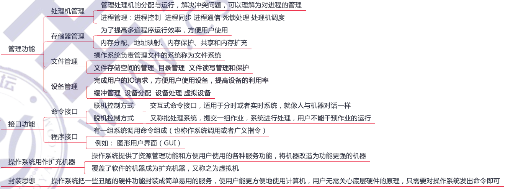

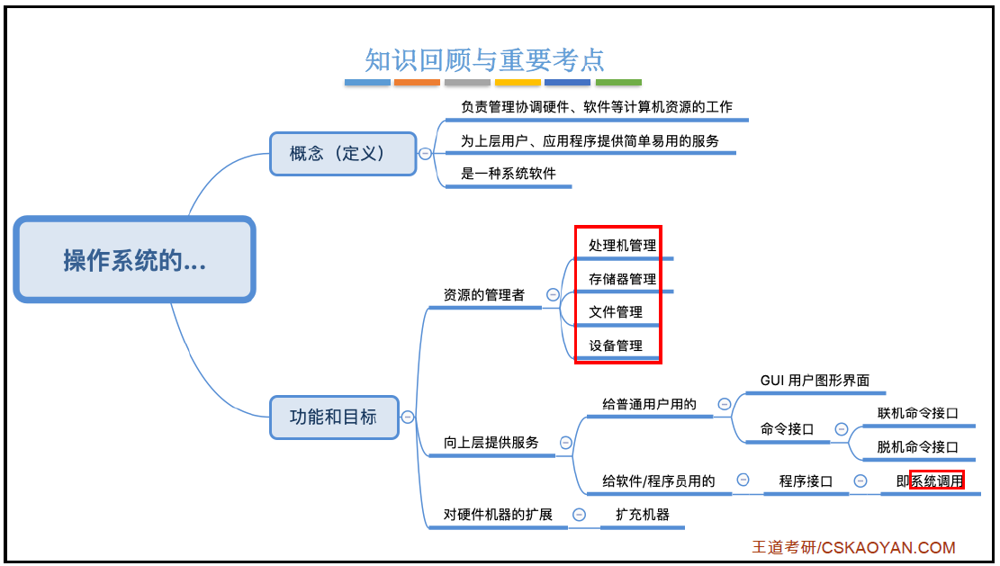

#### 概念

操作系统（Operating System， OS）是指控制和==管理==整个计算机系统的==硬件和软件==资源，并合理地组织调度计算机的工作和资源的分配；以==提供给用户和其他软件方便的接口和环境==；它是计算机系统中最基本的==系统软件==。

#### 功能和目标

##### ①操作系统是系统资源的管理者

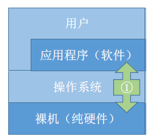

##### ②向上层提供方便易用的服务

==封装==思想：操作系统把一些丑陋的硬件功能封装成简单易用的服务，使用户能更方便地使用计算机，用户无需关心底层硬件的原理，只需要对操作系统发出命令即可。

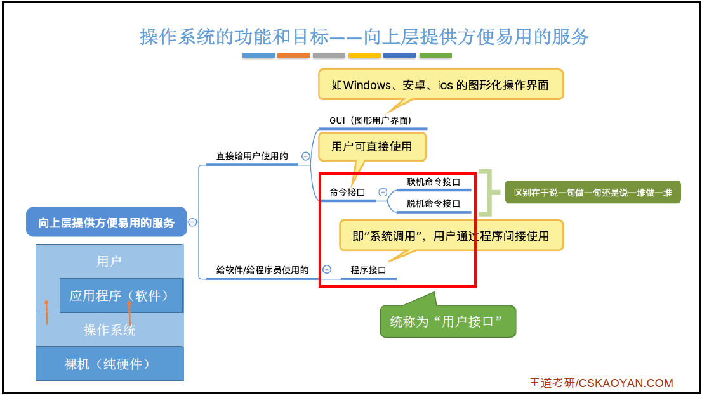

GUI：图形化用户接口（Graphical User Interface）
用户可以使用形象的图形界面进行操作，而==不再需要记忆复杂的命令、参数==。
例子：在Windows 操作系统中，删除一个文件只需要把文件“拖拽”到回收站即可。

联机命令接口=交互式命令接口：用户说一句，系统跟着做一句

脱机命令接口=批处理命令接口：用户说一堆，系统跟着做一堆

程序接口：可以在程序中进行==系统调用==来使用程序接口。普通用户不能直接使用程序接口，只能通过程序代码==间接==使用。

如：写C语言“Hello world”程序时，在printf 函数的底层就使用到了操作系统提供的显式相关的“系统调用”

##### ③是最接近硬件的一层软件

需要实现对==硬件机器的拓展==
没有任何软件支持的计算机称为==裸机==。在裸机上安装的操作系统，
可以提供资源管理功能和方便用户的服务功能，将裸机改造成功能
更强、使用更方便的机器
通常把覆盖了软件的机器成为==扩充机器==，又称之为==虚拟机==

### 1.1.2 操作系统的特征

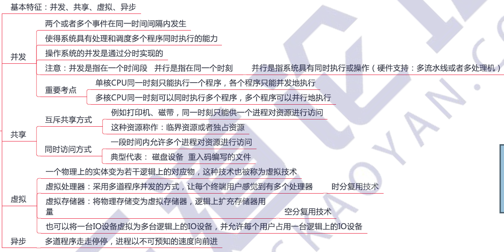

#### 基本特征

并发、共享、虚拟、异步

##### 并发

两个或者多个事件在==同一时间间隔==内发生

使得系统具有处理和调度多个程序同时执行的能力

操作系统的并发是通过分时实现的

注意：并发是指在一个时间段并行是指在同一个时刻并行是指系统具有同时执行或操作（硬件支持：多流水线或者多处理机）

重要考点

单核CPU同一时刻只能执行一个程序，各个程序只能==并发==地执行

多核CPU同一时刻可以同时执行多个程序，多个程序可以==并行==地执行

##### 共享

==互斥==共享方式

例如打印机、磁带，同一时刻只能供一个进程对资源进行访问

这种资源称作：临界资源或者独占资源

==同时==访问方式

一段时间内允许多个进程对资源进行访问

典型代表：磁盘设备重入码编写的文件

##### 虚拟

一个物理上的实体变为若干逻辑上的对应物，这种技术也被称为虚拟技术

虚拟处理器：采用多道程序==并发==的方式，让每个终端用户感觉到有多个处理器  ==时分复用技术==

虚拟存储器：将物理存储变为虚拟存储器，逻辑上扩充存储器用   ==空分复用技术==

也可以将一台IO设备虚拟为多台逻辑上的IO设备，并允许每个用户占用一台逻辑上的IO设备

##### 异步

在多道程序环境下，允许多个程序并发执行，但由于资源有限，进程的执行不是一贯到底的，

多道程序走走停停，进程以不可预知的速度向前进

#### 并发和共享的关系

并发性指计算机系统中同时存在着多个运行着的程序。
共享性是指系统中的资源可供内存中多个并发执行的进程共同使用。

互为存在条件

#### 并发和虚拟的关系

如果失去了并发性，则一个时间段内系统中只需运行一道程序，那么就失去了实现虚拟性的意义了。因此，==没有并发性，就谈不上虚拟性==

#### 并发和异步的关系

只有系统拥有并发性，才有可能导致异步性。

### 1.1.3 操作系统的发展与分类

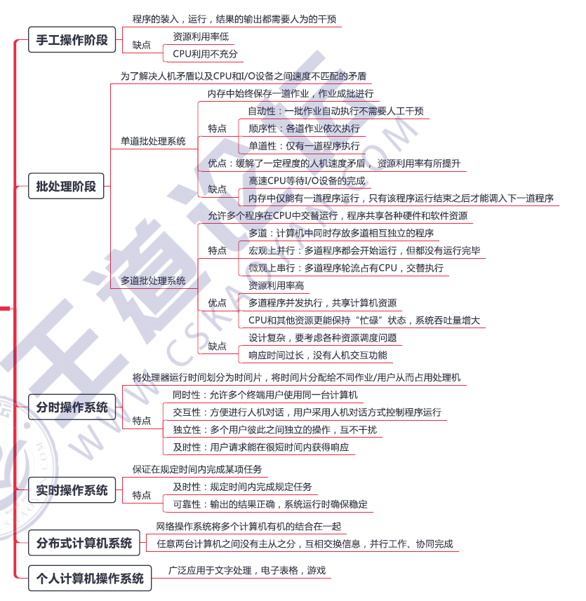

#### 手工操作阶段

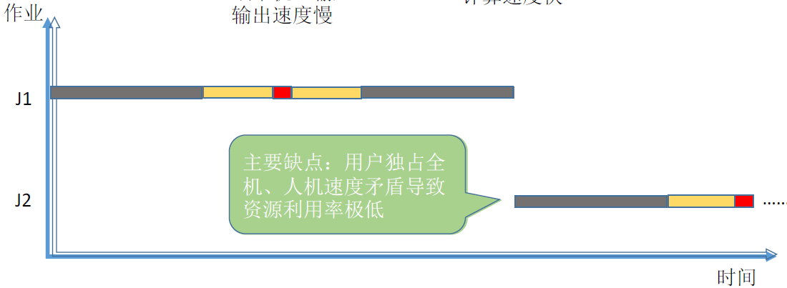

#### 单道批处理

省去人工阶段

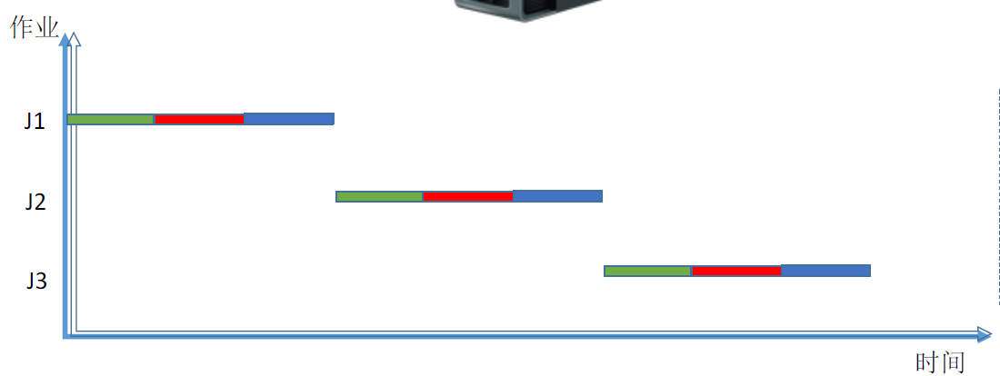

#### 多道批处理

多道程序

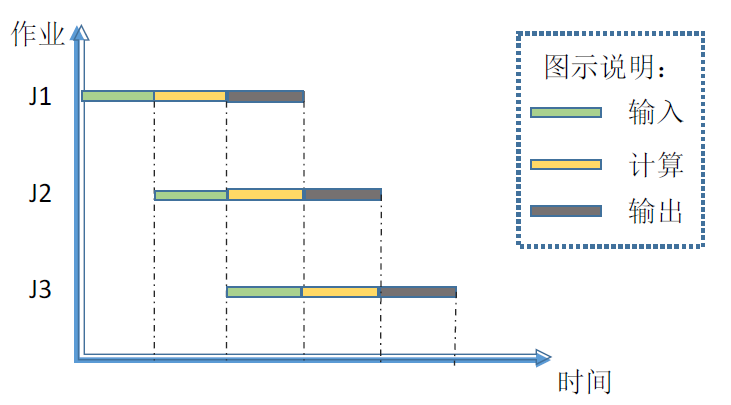

#### 分时操作

分时操作系统：计算机以==时间片==为单位==轮流==为各个用户/作业服务，各个用户可通过终端与计算机进行交互。
主要优点：用户请求可以被即时响应，==解决了人机交互问题==。允许多个用户同时使用一台计算机，并且用户对计算机的操作相互独立，感受不到别人的存在。
主要缺点：==不能优先处理一些紧急任务==。操作系统对各个用户/作业都是完全公平的，循环地为每个用户/作业服务一个时间片，不区分任务的紧急性。

#### 实时操作

主要优点：能够优先响应一些紧急任务，某些紧急任务不需时间片排队。
在实时操作系统的控制下，计算机系统接收到外部信号后及时进行处理，并且==要在严格的时限内处理完事件==。实时操作系统的主要特点是==及时性和可靠性==

#### 其他几种操作系统

网络操作系统：是伴随着计算机网络的发展而诞生的，能把网络中各个计算机有机地结合起来，实现数据传送等功能，实现网络中各种资源的共享（如文件共享）和各台计算机之间的通信。（如：Windows NT 就是一种典型的网络操作系统，网站服务器就可以使用）

分布式操作系统：主要特点是分布性和并行性。系统中的各台计算机地位相同，任何工作都可以分布在这些计算机上，由它们并行、协同完成这个任务。

个人计算机操作系统：如Windows XP、MacOS，方便个人使用。

### 1.1.4 操作系统的运行机制

#### 运行机制

##### 两种指令：特权指令v.s. 非特权指令

+ “指令”就是处理器（CPU）能识别、执行的最基本命令，指==二进制==机器指令

+ 应用程序只能使用“==非特权指令==””，如：加法指令、减法指令等

+ 操作系统内核作为“管理者”，有时会让CPU执行一些“==特权指令==”，如：内存清零指令。这些指令影响重大，只允许“管理者”——即操作系统内核来使用

##### 两种程序

我们普通程序员写的程序就是==“应用程序”==
微软、苹果有一帮人负责实现操作系统，他们写的是==“内核程序”==
由很多内核程序组成了“操作系统内核”，或简称“内核（Kernel）”

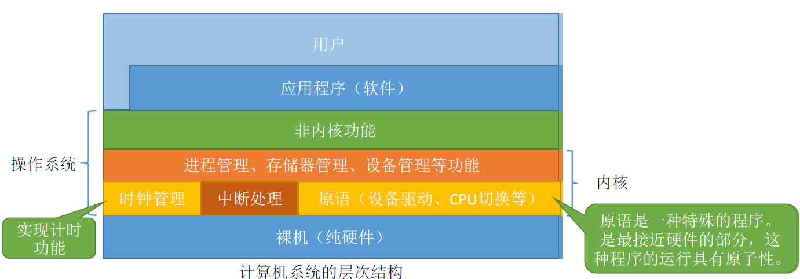

##### 两种处理器状态：内核态v.s. 用户态

+ CPU 有两种状态，“内核态”和“用户态”

  处于内核态时，说明此时正在运行的是==内核程序==，此时可以执行==特权指令==
  处于用户态时，说明此时正在运行的是==应用程序==，此时只能执行==非特权指令==

+ 内核态、用户态的切换

  内核态--用户态：执行一条==特权指令==——修改==PSW==的标志位为“用户态”，这个动作意味着操作系统将主动让出CPU使用权
  用户态--内核态：由“==中断==”引发，==硬件自动完成变态过程==，触发中断信号意味着操作系统将强行==夺回==CPU的使用权

#### 内核

##### 时钟管理

##### 中断处理

##### 原语

原语是一种特殊的程序。是最接近硬件的部分，这种程序的运行具有==原子性==。

##### 对系统资源进行管理的功能

进程管理

存储器管理

设备管理

#### 体系结构

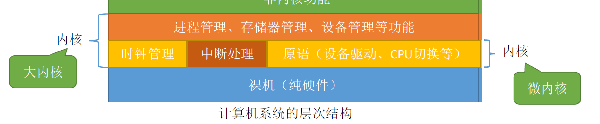

内核就是企业的管理层，负责一些重要的工作。只有管理层才能执行特权指令，普通员工只能
执行非特权指令。用户态、核心态之间的切换相当于普通员工和管理层之间的工作交接
大内核：企业初创时体量不大，管理层的人会负责大部分的事情。优点是==效率高==；缺点是组织
结构混乱，难以维护。
微内核：随着企业体量越来越大，管理层只负责最核心的一些工作。优点是==组织结构清晰==，方
便维护；缺点是效率低。

##### 大内核

##### 微内核

### 1.1.5 中断和异常

#### 中断的作用

CPU 上会运行两种程序，一种是操作系统内核程序，一种是应用程序

“中断”是让操作系统内核==夺回CPU使用权==的唯一途径

#### 中断的类型

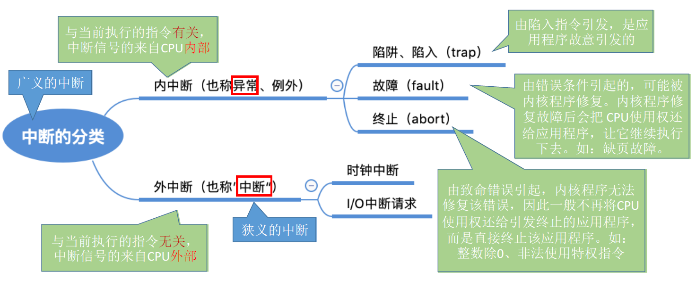

+ 内中断与当前执行的指令有关，中断信号来源于CPU内部

+ 外中断与当前执行的指令无关，中断信号来源于CPU外部

#### 中断机制的基本原理

不同的中断信号，需要用不同的中断处理程序来处理。当CPU检测到中断信号后，会根据中断信号的类型去查询“中断向量表”，以此来找到相应的中断处理程序在内存中的存放位置。

### 1.1.6 系统调用

“系统调用”是操作系统==提供给应用程序==（程序员/编程人员）使用的接口，可以理解为一种可供应用程序调用的特殊函数，应用程序可以通过系统调用来请求==获得操作系统内核==的服务

应用程序通过系统调用请求操作系统的服务。而系统中的各种共享资源都由操作系统内核统一掌管，因此凡是与共享资源有关的操作（如存储分配、I/O操作、文件管理等），都必须通过系统调用的方式向操作系统内核提出服务请求，由操作系统内核代为完成。这样可以保证系统的==稳定性和安全性==，防止用户进行非法操作。

### 1.1.7 操作系统的体系结构

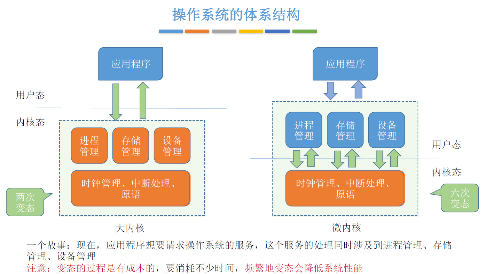

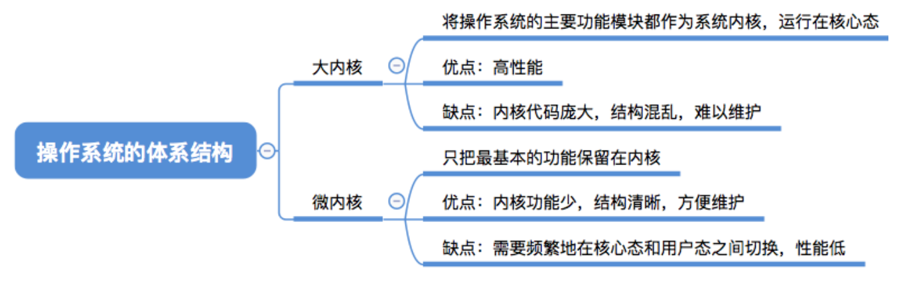

# 第二章 进程管理

## 2.1 进程和线程

### 2.1.1 进程的概念、组成、特征

#### 概念

进程（Process）：是动态的，是程序的一次执行过程

同一个程序多次执行会对应多个进程

#### 组成

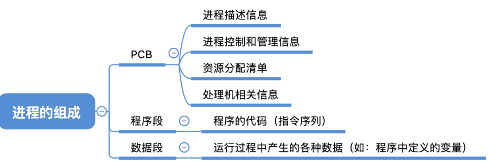

当进程被创建时，操作系统会为该进程分配一个唯一的、不重复的“身份证号”—— ==PID==（Process ID，进程ID）

这些信息都被保存在一个数据结构==PCB==（Process Control Block）中，即==进程控制块==操作系统需要对各个并发运行的进程进行管理，但凡管理时所需要的信息，都会被放在PCB中

#### 特征

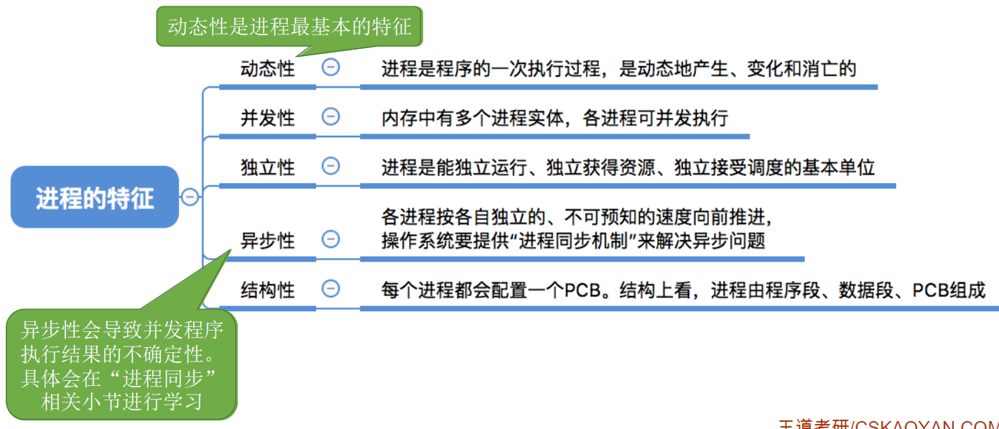

动态性：动态性是进程==最基本特征==，进程有着创建、活动、暂停、终止等过程，具有生命周期

并发性：多个进程实体同时存在内存中，引入进程的目的就是为了程序与其他程序并发执行

独立性：进程实体是一个能独立运行、独立获得资源和独立接受调度的基本单位。没有建立PCB的程序，都不能作为一个独立单位参与运行

异步性：进程相互制约，进程以==不可预知的速度==向前推进。所以操作系统中一定要配置响应的进程同步机制程序段

结构性：每个进程都配置一个PCB对其进行描述（数据段、进程实体、进程控制段）

### 2.1.2 进程的状态与转换、进程的组织

#### 进程的状态

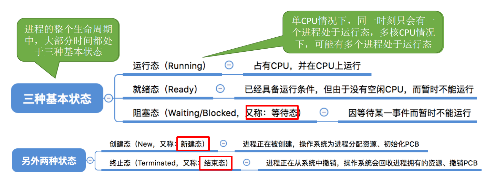

+ 创建态
+ 就绪态
+ 运行态
+ 阻塞态
+ 终止态

#### 进程的转换

#### 进程的组织

### 2.1.3 进程控制

进程控制就是要实现进程状态转换

+ 如何实现==进程控制==？

  用“==原语==”实现

  原语的执行具有“原子性”，一气呵成

+ 如何实现原语的“原子性”？

  原语的执行具有原子性，即执行过程只能一气呵成，期间不允许被中断。可以用“关中断指令”和“开中断指令”这两个特权指令实现原子性

#### 进程的创建

用户登录，作业调度，提供服务，应用请求

#### 进程的终止

正常结束、异常结束、外界干预

#### 进程的阻塞

阻塞态是==暂时==停止运行，比如等待IO操作，等待其他进程配合

#### 进程的唤醒

等待的事件发生

#### 进程的切换

当前进程时间片到

有更高优先级的进程到达

当前进程主动阻塞

当前进程终止

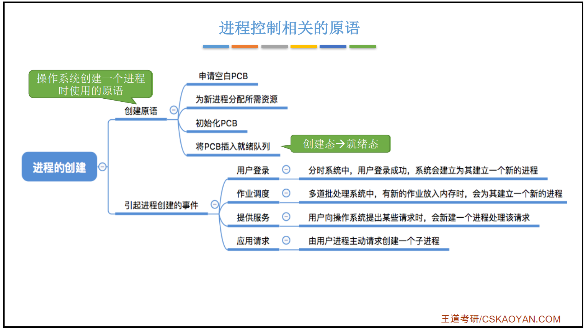

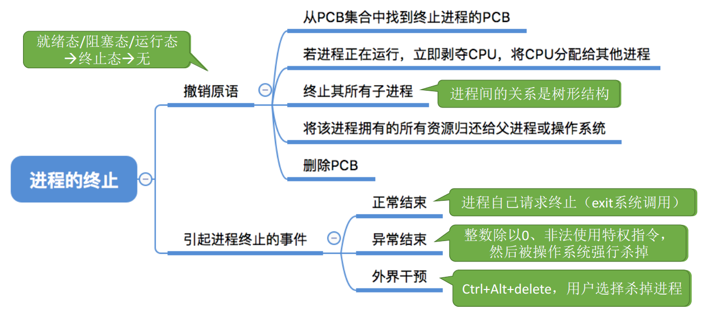

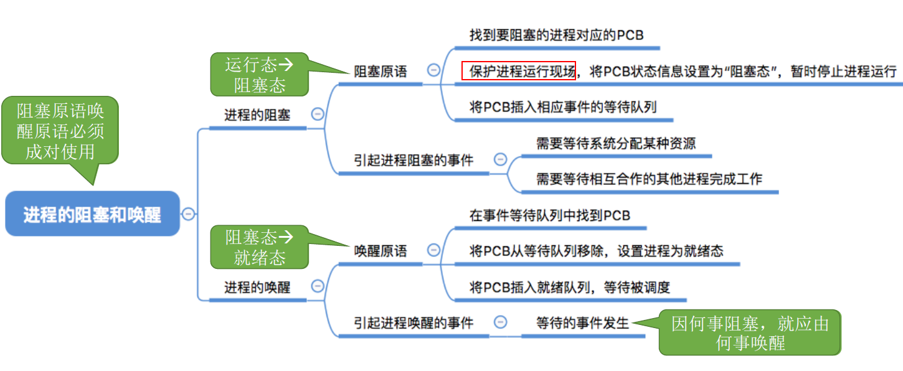

==阻塞态是暂时停止运行，比如等待IO操作==

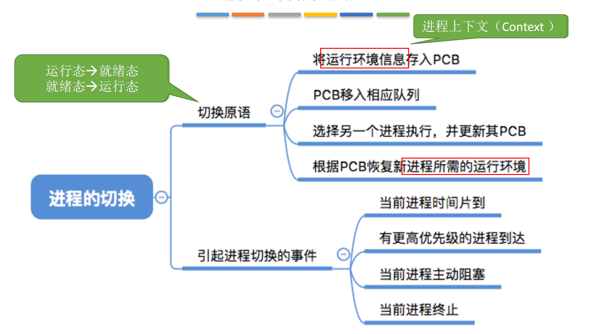

### 2.1.4 进程通信

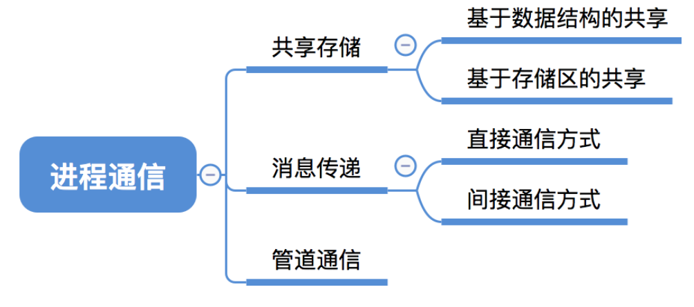

#### 什么是进程通信？

进程通信就是指进程之间的==信息交换==。
进程是分配系统资源的单位（包括内存地址空间），因此==各进程==拥有的==内存地址空间相互独立==。

为了保证安全，==一个进程不能直接访问另一个进程的地址空间==。

#### 共享存储

==基于数据结构==的共享：比如共享空间里只能放一个长度为10的数组。这种共享方式速度慢、限制多，是一种低级通信方式
==基于存储区==的共享：在内存中画出一块共享存储区，数据的形式、存放位置都由进程控制，而不是操作系统。相比之下，这种共享方式速度更快，是一种高级通信方式。

#### 管道通信

数据以字符流的形式写入管道，当管道==写满==时，写进程的write（）系统调用将被阻塞，等待读进程将数据取走。当读进程将数据全部==取走后==，管道==变空==，此时读进程的read（）系统调用将被阻塞。

如果==没写满，就不允许读==。如果==没读空，就不允许写==。

数据==一旦被读出，就从管道中被抛弃==，这就意味着读进程最多只能有一个，否则可能会有读错数据的情况。

#### 消息传递

进程间的数据交换以==格式化的消息==（Message）为单位。进程通过操作系统提供的“发送消息/接收消息”两个==原语==进行数据交换。

间接通信：消息要先发送到中间实体（信箱）中，因此也称“信箱通信方式”。

### 2.1.5 线程的概念和特点

#### 什么是线程，为什么要引入线程？

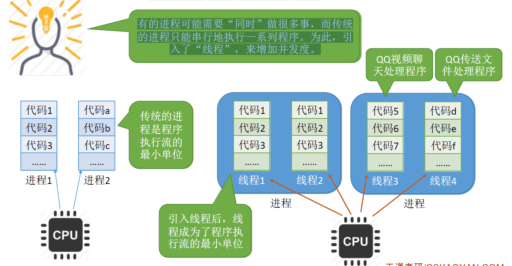

有的进程可能需要“同时”做很多事，而传统的进程只能串行地执行一系列程序。为此，引入了“线程”，来增加并发度。

可以把线程理解为“==轻量级进程==”。
线程是一个==基本的CPU执行单元==，也是==程序**执行流**的最小单位==。

引入线程之后，不仅是进程之间可以并发，==进程内的各线程之间也可以并发==，从而进一步提升了系统的==并发度==，使得一个进程内也可以并发处理各种任务（如QQ视频、文字聊天、传文件）

引入线程后，==进程==只作为除CPU之外的==**系统资源的**分配单元==（如打印机、内存地址空间等都是分配给进程的）。==线程==则作为==**处理机**的分配单元==。

#### 进程与线程比较

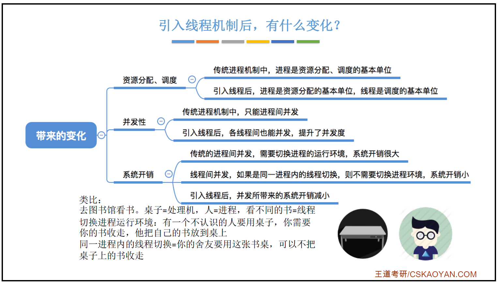

#### 线程属性

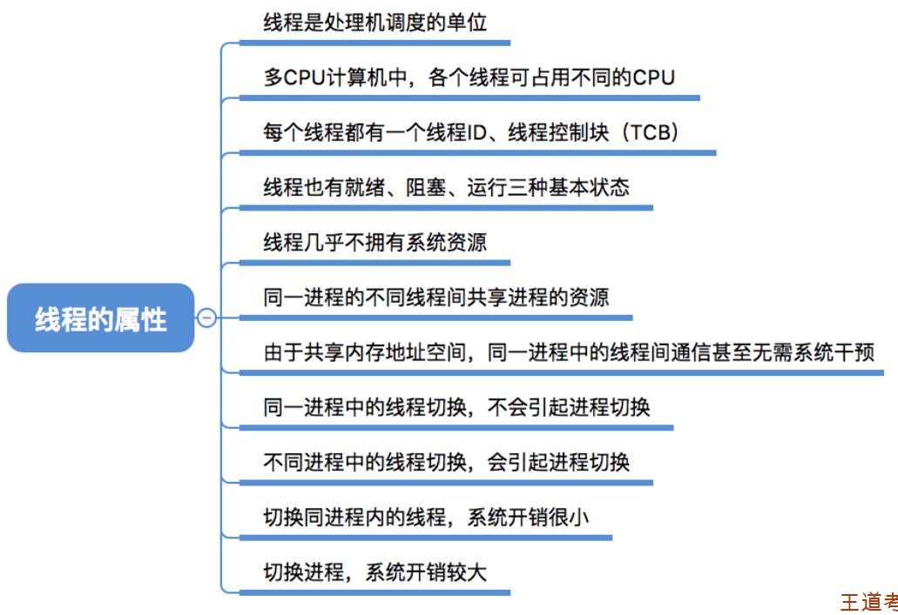

### 2.1.6 线程的实现方法和多线程

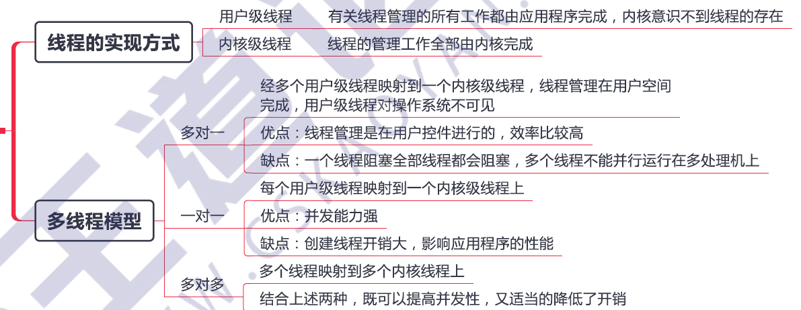

while 循环就是一个最弱智的“线程库”，线程库完成了对线程的管理工作（如调度）。

## 2.2 调度

### 2.2.1 调度的概念、层次

#### 基本概念

合理的对进程进行处理及分配

#### 调度的层次

##### 高级调度（作业调度）

按一定的原则从外存的作业后备队列中挑选一个作业调入内存，并创建进程。每个作业==只调入一次，调出一次==。作业调入时会建立PCB，调出时才撤销PCB。

##### 中级调度（内存调度）

按照某种策略决定将哪个处于挂起状态的进程==重新调入内存==。
一个进程可能会被多次调出、调入内存，因此中级调度发生的频率要比高级调度更高。

##### 低级调度（进程调度/处理机调度）

按照某种策略从==就绪队列==中选取一个进程，将处理机分配给它。

进程调度是操作系统中==最基本的一种调度==，在一般的操作系统中都必须配置进程调度。
进程调度的==频率很高==，一般几十毫秒一次。

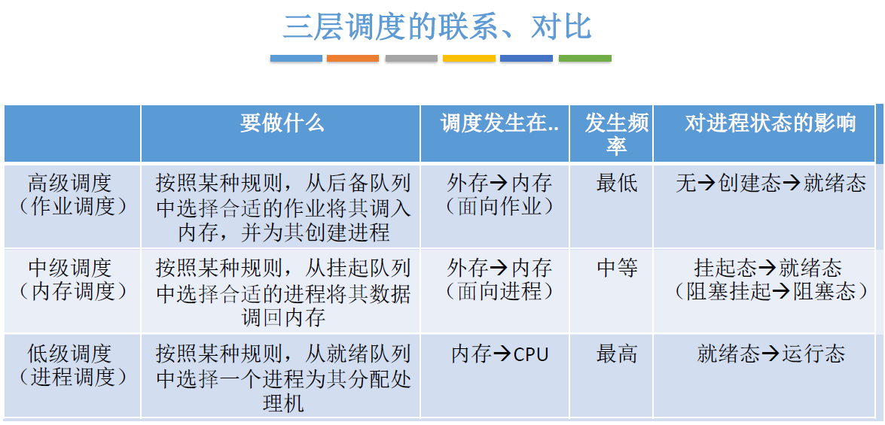

#### 补充知识：七种状态

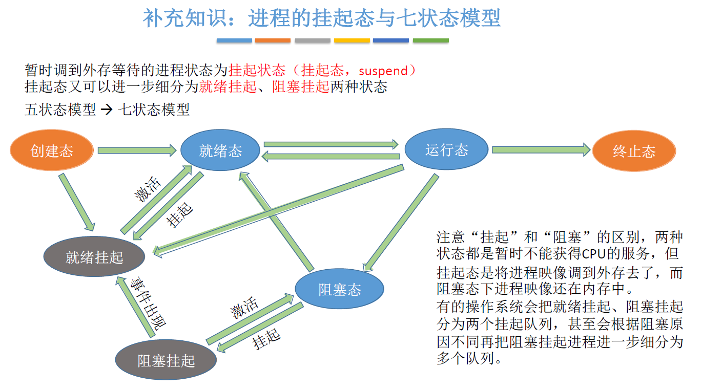

### 2.2.2 进程调度的时机切换与过程调度方式

#### 切换时机

##### 不能切换的情况

1. 在==处理中断==的过程中。中断处理过程复杂，与硬件密切相关，很难做到在中断处理过程中进行进程切换。
2. 进程在==操作系统内核程序临界区==中。
3. 在==原子操作过程==中（原语）。原子操作不可中断，要一气呵成（如之前讲过的修改PCB中进程状态标志，并把PCB放到相应队列）

##### 可以切换的情况

当前运行的进程==主动放弃==处理机

+ 进程正常终止
+ 运行过程中发生异常而终止
+ 进程主动请求阻塞（如等待I/O）

当前运行的进程==被动放弃==处理机

+ 分给进程的时间片用完
+ 有更紧急的事需要处理（如I/O中断）
+ 有更高优先级的进程进入就绪队列

#### 调度方式

==非剥夺调度方式==，又称非抢占方式。即，只允许进程主动放弃处理机。在运行过程中即便有更紧迫的任务到达，当前进程依然会继续使用处理机，直到该进程终止或主动要求进入阻塞态。

==剥夺调度方式==，又称抢占方式。当一个进程正在处理机上执行时，如果有一个更重要或更紧迫的进程需要使用处理机，则立即暂停正在执行的进程，将处理机分配给更重要紧迫的那个进程。

#### 进程的切换与过程

==进程切换==是指一个进程让出处理机，由另一个进程占用处理机的过程。

==狭义的进程调度==指的是从就绪队列中选中一个要运行的进程。

==广义的进程调度==包含了==选择一个进程==和==进程切换==两个步骤。

进程切换的过程主要完成了：

1. 对==原来==运行进程各种数据的==保存==
2. 对==新==的进程各种数据的==恢复==

### 2.2.3 调度算法的评价指标

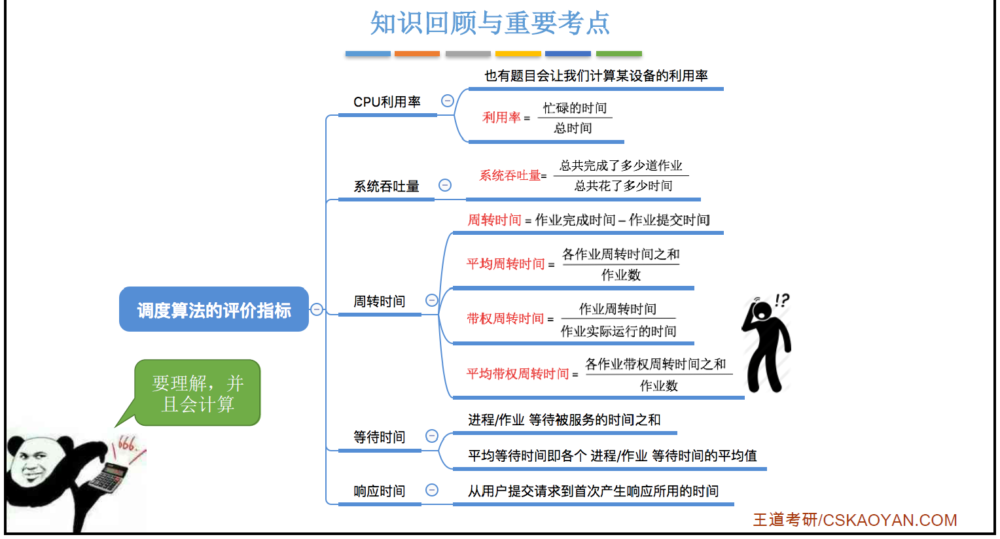

### 2.2.4 调度算法1

#### 先来先服务（FCFS）

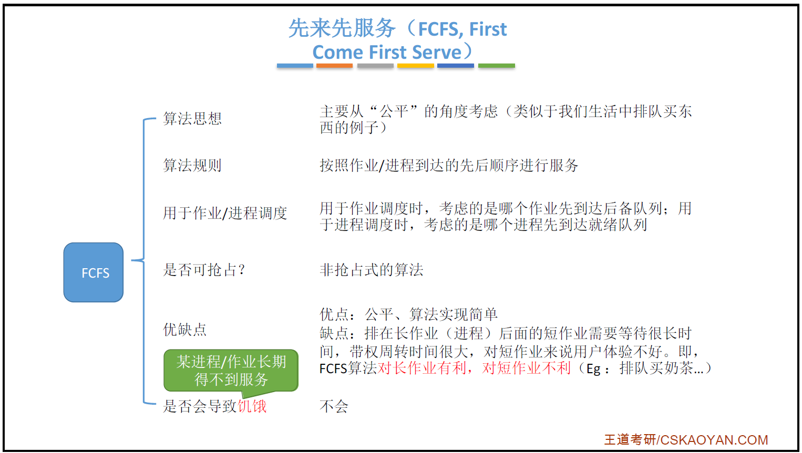

#### 最短作业优先（SJF）

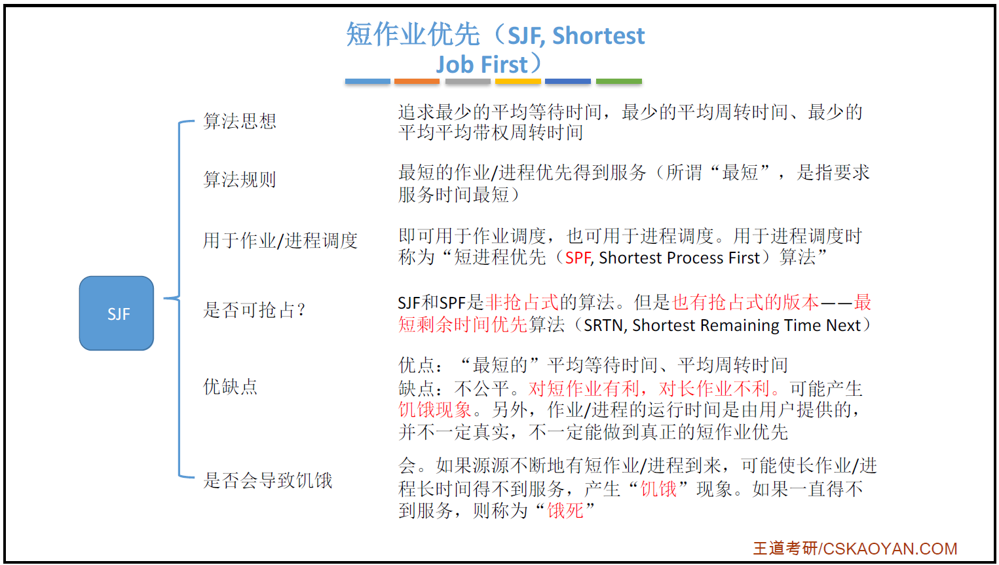

#### 最高响应比优先（HRRN）

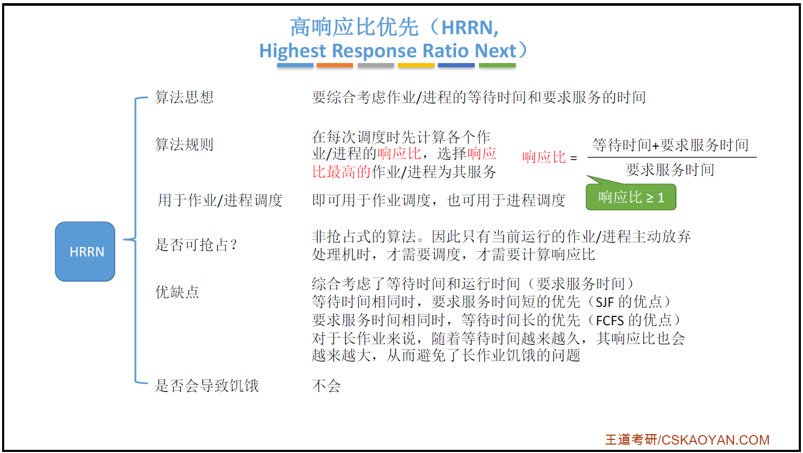

### 2.2.5 调度算法2

#### 时间片轮转（RR）

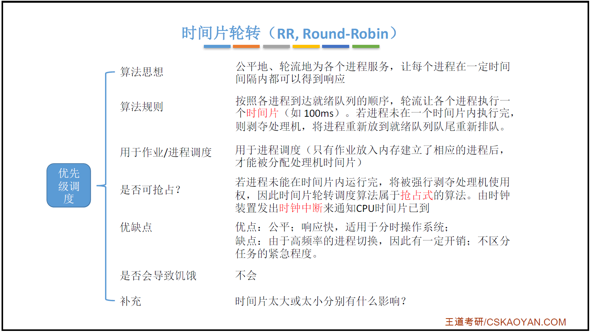

#### 优先级调度

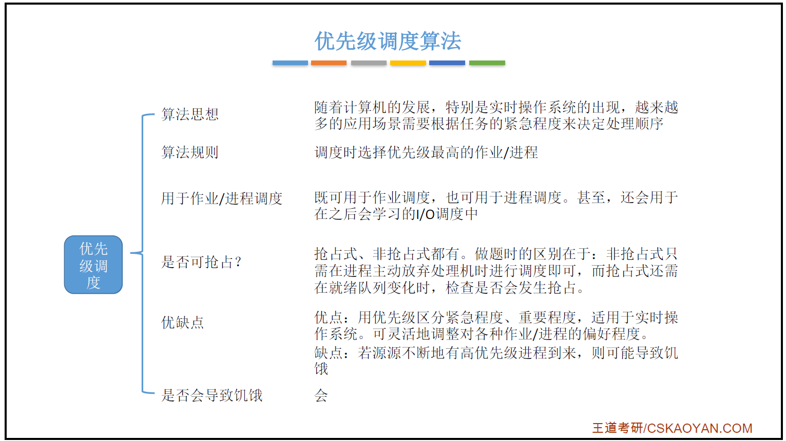

#### 多级反馈队列

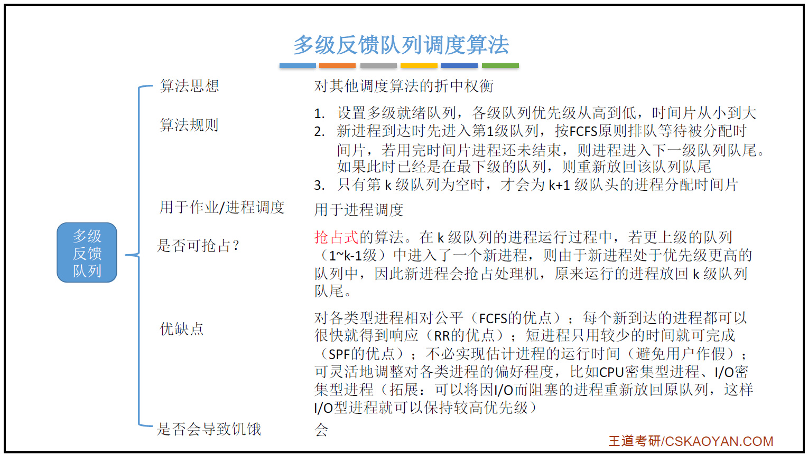

对各类型进程==相对公平==（FCFS的优点）；

每个新到达的进程都可以==很快就得到响应==（RR的优点）；

==短进程只用较少的时间==就可完成（SPF的优点）；

不必实现估计进程的运行时间（避免用户作假）；

可灵活地调整对各类进程的偏好程度，比如CPU密集型进程、I/O密集型进程（拓展：可以将因I/O而阻塞的进程重新放回原队列，这样I/O型进程就可以==保持较高优先级==）

一般不说它有缺点，不过可能导致==饥饿==

## 2.3 互斥同步

### 2.3.1 进程同步、进程互斥

#### 进程同步

同步亦称==直接制约关系==，它是指为完成某种任务而建立的两个或多个进程，这些进程因为需要在某些位置上协调它们的==工作次序==而产生的==制约关系==。

进程间的直接制约关系就是源于它们之间的相互合作。

解决异步问题

#### 进程互斥

==间接制约关系==。进程互斥指当一个进程访问某临界资源时，另一个想要访问该临界资源的进程必须等待

#### 临界区资源的互斥访问

临界区：访问临界资源的那段代码

进入区：负责检查是否可进入临界区

退出区：负责解除正在访问临界资源的标志

剩余区：做其他处理

临界区是进程中==访问临界资源==的代码段。

进入区和退出区是负责==实现互斥==的代码段。

临界区也可称为“临界段”。

原则

1. 空闲让进。临界区空闲时，可以允许一个请求进入临界区的进程立即进入临界区；
2. 忙则等待。当已有进程进入临界区时，其他试图进入临界区的进程必须等待；
3. 有限等待。对请求访问的进程，应保证能在有限时间内进入临界区（保证不会饥饿）；
4. 让权等待。当进程不能进入临界区时，应立即释放处理机，防止进程忙等待。

### 2.3.2 进程互斥的软件实现方法

#### 单标志法

算法思想：两个进程在==访问完==临界区后会把使用临界区的权限==转交==给另一个进程。也就是说==每个进程进入临界区的权限只能被另一个进程赋予==。交替进入临界区。

主要问题：违背“空闲让进”原则，必须“轮流访问”

#### 双标志先检查法

每个进程访问临界资源前，先检查临界资源是否被访问，如果空闲才能进

优点：不用交替进入可以连续使用

主要问题：违反“忙则等待”原则。

原因在于，进入区的==“检查”==和==“上锁”==两个处理不是一气呵成的。“检查”后，“上锁”前==可能发生进程切换==。

#### 双标志后检查法

先设置标志，表示自己想进入，检查对方标志，如果对方也要进入，那么就等待否则就进入

优点：不会两个进程都进入临界区

缺点：双方会互相谦让，导致饥饿

#### Peterson 算法

算法思想：结合双标志法、单标志法的思想。如果双方都争着想进入临界区，那可以让进程尝试“孔融让梨”（谦让）。做一个有礼貌的进程。

增加标志位

优点：不会饥饿

缺点：复杂

### 2.3.3 进程互斥的硬件实现方法

#### 中断屏蔽法

利用“开/关中断指令”实现（与原语的实现思想相同，即在某进程开始访问临界区到结束访问为止都不允许被中断，也就不能发生进程切换，因此也不可能发生两个同时访问临界区的情况）

优点：简单、高效
缺点：不适用于多处理机；只适用于操作系统内核进程，不适用于用户进程（因为开/关中断指令 只能运行在内核态，这组指令如果能让用户随意使用会很危险）

#### TestAndSet指令（TSL）

TSL 指令是用硬件实现的，执行的过程不允许被中断，只能一气呵成

相比软件实现方法，TSL 指令把“上锁”和“检查”操作用硬件的方式变成了一气呵成的原子操作。

优点：实现简单，无需像软件实现方法那样严格检查是否会有逻辑漏洞；适用于==多处理机环境==

缺点：==不满足“让权等待”原则==，暂时无法进入临界区的进程会占用CPU并循环执行TSL指令，从 而导致“忙等”。

#### Swap指令（XCHG）

逻辑上来看 Swap 和 TSL 并无太大区别，都是先记录下此时临界区是否已经被上锁（记录在 old 变 量上），再将上锁标记 lock 设置为 true，最后检查 old，如果 old 为 false 则说明之前没有别的进程 对临界区上锁，则可跳出循环，进入临界区。 

优点：实现简单，无需像软件实现方法那样严格检查是否会有逻辑漏洞；适用于多处理机环境 

缺点：不满足“让权等待”原则，暂时无法进入临界区的进程会占用CPU并循环执行TSL指令，从 而导致“忙等”。

### 2.3.4 信号量机制

==实现进程互斥、同步的方法==

==信号量==其实就是一个==变量==，可以用一个信号量来表示系统中==某种资源的数量==

wait、signal 原语常简称为==P、V操作==（来自荷兰语proberen 和verhogen）。因此，做题的时候常把wait（S）、signal（S） 两个操作分别写为P（S）、V（S）

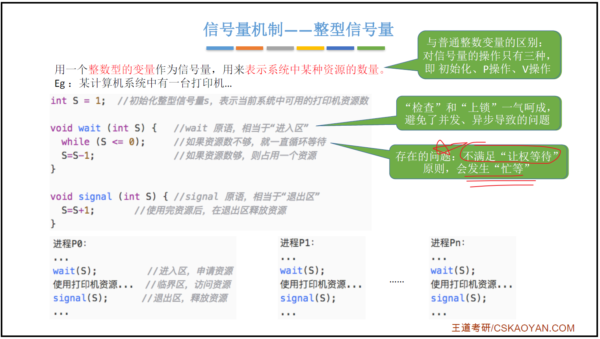

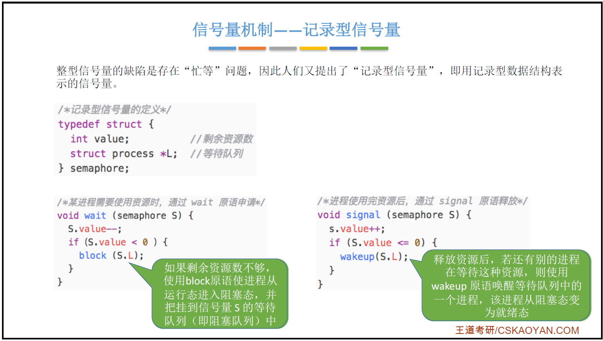

P上锁

V解锁

### 2.3.5 用信号量机制实现进程互斥、同步、前驱关系

#### 实现进程互斥

上锁——解锁

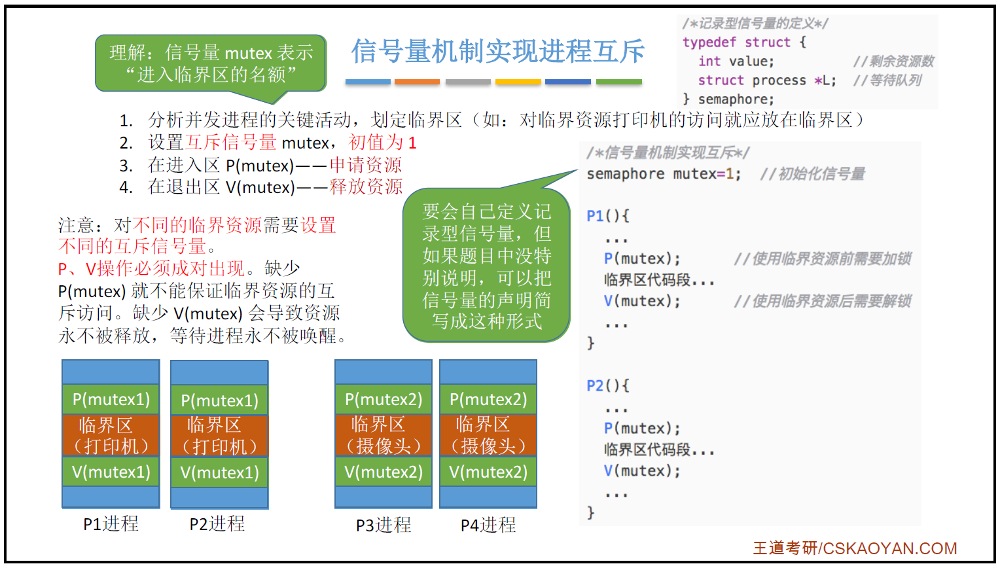

#### 实现进程同步、前驱关系

解锁——上锁

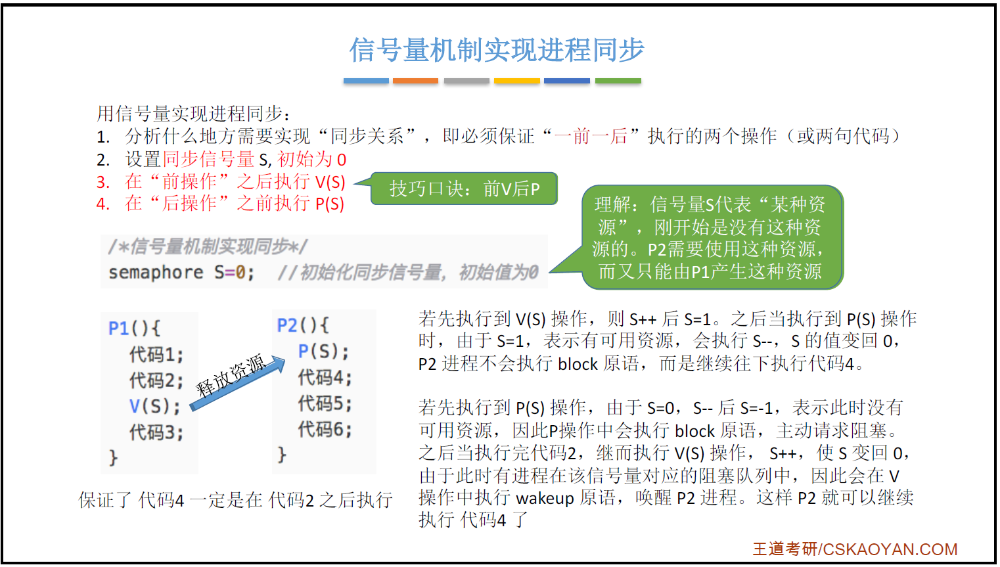

#### 实现前驱关系

画图非常有用

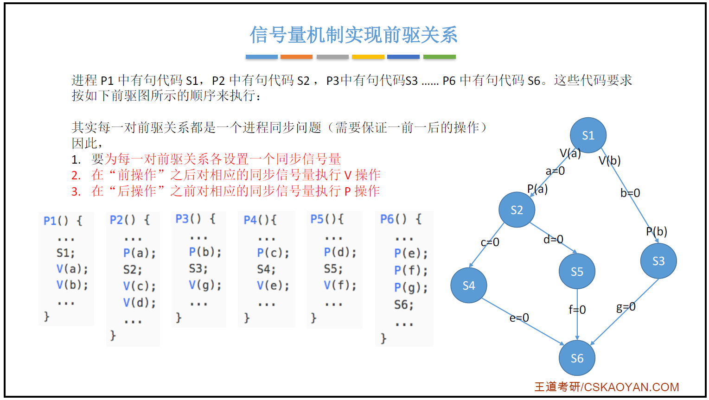

### 2.3.6 生产者消费者问题

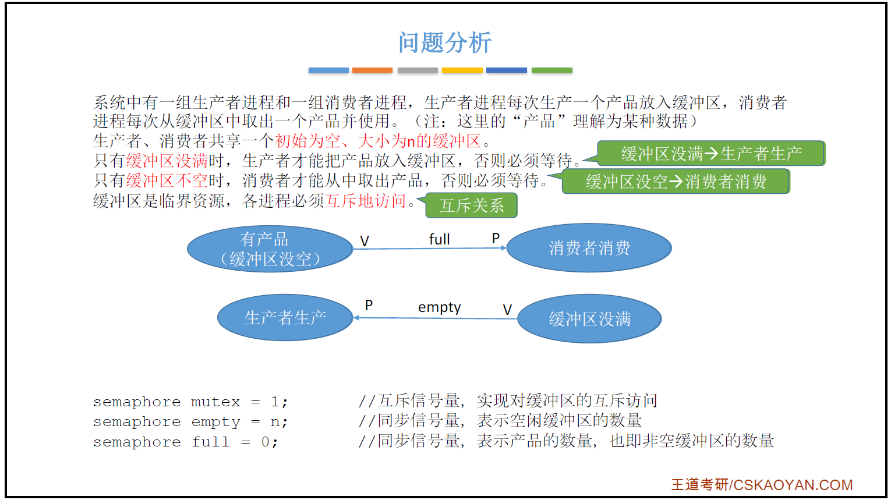

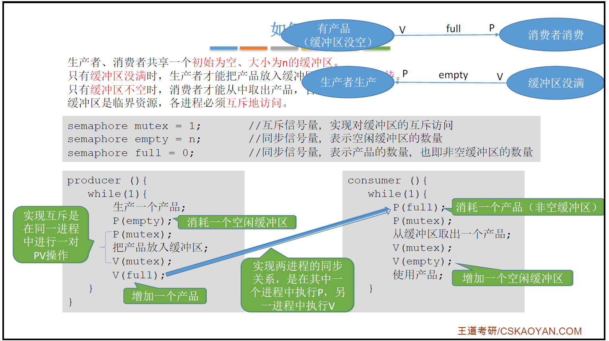

#### 思考：能否改变相邻P、V操作的顺序？

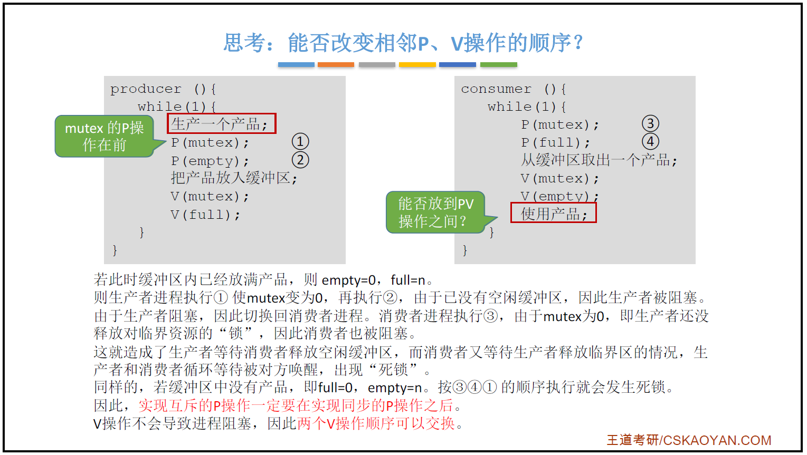

会导致：我要放东西通过了，但满了放不进去，去到消费者，但通道被生产者占住了，形成死锁
同步：查看缓存区容量和非空区
互斥：消费者和生产者不能同时使用缓存区

### 2.3.7 多生产者-多消费者

==画图非常有用==

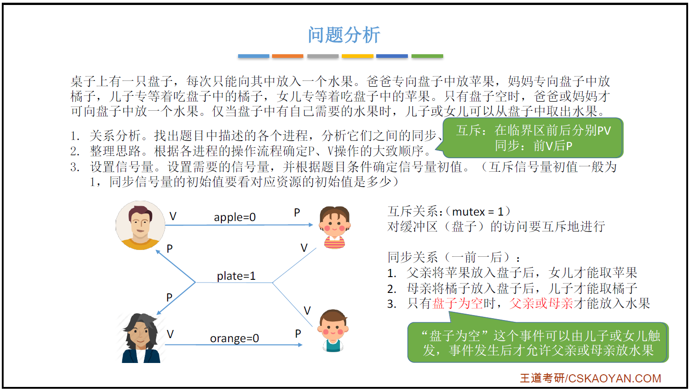

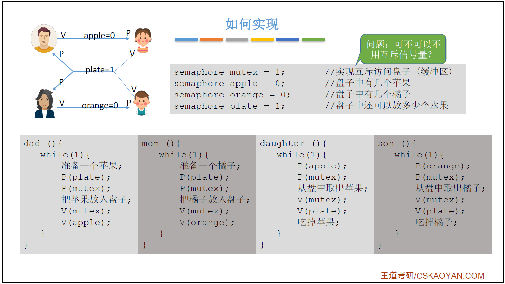

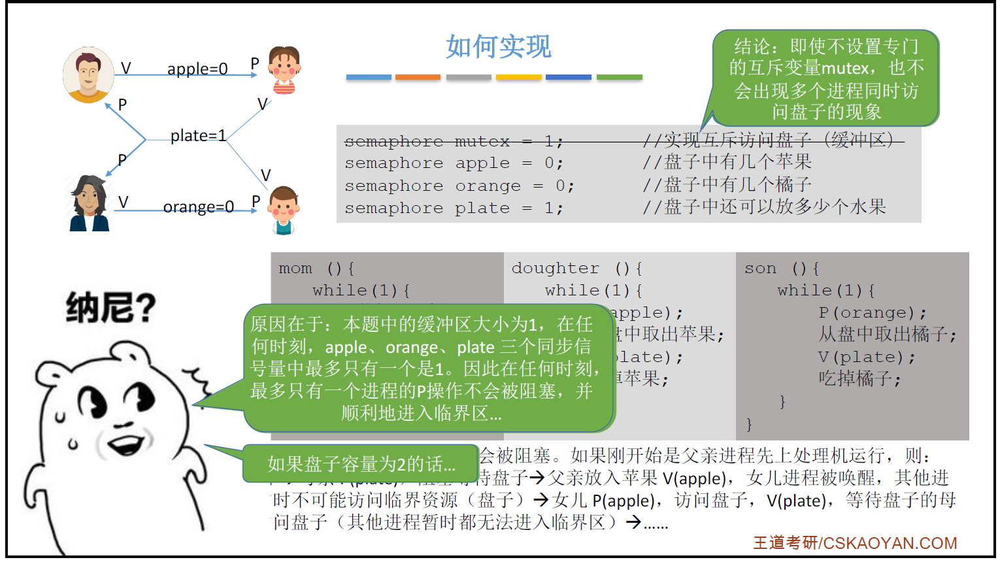

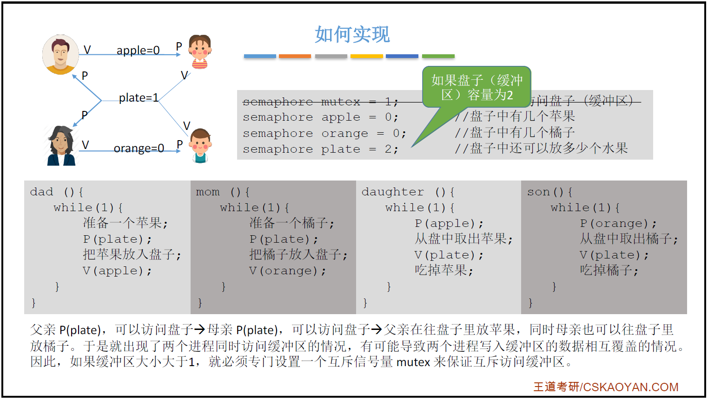

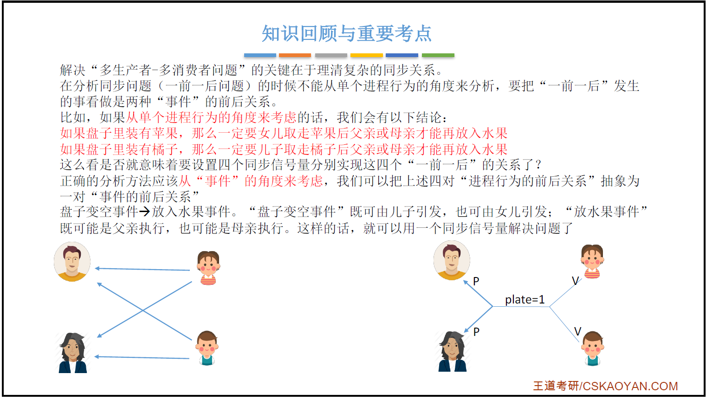

### 2.3.8 吸烟者问题

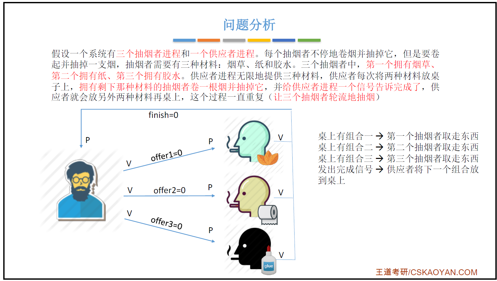

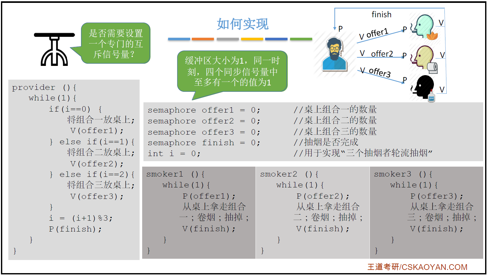

### 2.3.9 读者-写者问题

写和读，写和写不能同时访问

==但读和读可以同时访问==


+ “读优先”


==第一个读者先加两把锁，都关上，再打开互斥锁，让其他读者进行访问==

+ ”写优先“相对公平


==第一个读者先加三把锁，都关上，再打开互斥锁和写优先锁，且先打开写优先锁，使只要读者读完就给写==

### 2.3.10 哲学家进餐问题

没什么意思


### 2.3.11 管程

---

#### 为什么要引入管程

信号量机制存在的问题：编写程序困难、易出错

#### 管程的定义

1.   局部于管程的共享数据结构说明；
2.   对该数据结构进行操作的一组过程；
3.   对局部于管程的共享数据设置初始值的语句；
4.   管程有一个名字。

#### 基本特征

1.   局部于管程的数据只能被局部于管程的过程所访问；
2.   一个进程只有通过调用管程内的过程才能进入管程访问共享数据
3.   每次仅允许一个进程在管程内执行某个内部过程。

## 2.4 死锁

### 2.4.1 死锁的概念

在并发环境下，各进程因==竞争资源==而造成的一种==互相等待==对方手里的资源，导致各进程都==阻塞==，都无法向前推进的现象，就是“死锁”。发生死锁后若==无外力干涉==，这些进程都将==无法向前推进==。

#### 必要条件

==互斥条件==：只有对必须==互斥使用==的资源的争抢才会导致死锁（如哲学家的筷子、打印机设备）。像内存、扬声器这样可以同时让多个进程使用的资源是不会导致死锁的（因为进程不用阻塞等待这种资源）。
==不剥夺条件==：进程所获得的资源在未使用完之前，不能由其他进程强行夺走，只能主动释放。
==请求和保持条件==：进程已经保持了至少一个资源，但又提出了新的资源请求，而该资源又被其他进程占有，此时请求进程被阻塞，但又对自己已有的资源==保持不放==。
==循环等待条件==：存在一种进程资源的==循环等待链==，链中的每一个进程已获得的资源同时被下一个进程所请求。

### 2.4.2 预防死锁

#### 破坏互斥条件

互斥条件：只有对必须互斥使用的资源的争抢才会导致死锁。

把只能互斥使用的资源改造为==允许共享使用==，则系统不会进入死锁状态。

缺点：并不是所有的资源都可以改造成可共享使用的资源。

#### 破坏不剥夺条件

不剥夺条件：进程所获得的资源在未使用完之前，不能由其他进程强行夺走，只能主动释放。

破坏不剥夺条件：
方案一：当某个进程请求新的资源得不到满足时，它必须立即释放保持的所有资源，待以后需要时再重新申请。也就是说，即使某些资源尚未使用完，也需要主动释放，从而破坏了不可剥夺条件。

方案二：当某个进程需要的资源被其他进程所占有的时候，可以由操作系统协助，将想要的资源强行剥夺。这种方式一般需要考虑各进程的优先级（比如：剥夺调度方式，就是将处理机资源强行剥夺给优先级更高的进程使用）

缺点：
1. 实现起来比较==复杂==。
2. 释放已获得的资源可能造成==前一阶段工作的失效==。因此这种方法一般只适用于易保存和恢复状态的资源，如CPU。
3. 反复地申请和释放资源会增加系统==开销==，降低系统吞吐量。
4. 若采用方案一，意味着只要暂时得不到某个资源，之前获得的那些资源就都需要放弃，以后再重新申请。如果一直发生这样的情况，就会导致进程==饥饿==。

#### 破坏请求和保持条件

请求和保持条件：进程已经保持了至少一个资源，但又提出了新的资源请求，而该资源又被其他进程占有，此时请求进程被阻塞，但又对自己已有的资源保持不放。

可以采用静态分配方法，即进程在运行前==一次申请完==它所需要的全部资源，在它的资源未满足前，不让它投入运行。一旦投入运行后，这些资源就一直归它所有，该进程就不会再请求别的任何资源了。

缺点：
有些资源可能只需要用很短的时间，因此如果进程的整个运行期间都一直保持着所有资源，就会造成==严重的资源浪费==，资源利用率极低。

另外，该策略也有可能导致某些进程==饥饿==。

#### 破坏循环等待条件

循环等待条件：存在一种进程资源的循环等待链，链中的每一个进程已获得的资源同时被下一个进程所请求。

可采用顺序资源分配法。首先给系统中的==资源编号==，规定每个进程必须按编号递增的==顺序请求==资源，同类资源（即编号相同的资源）一次申请完。

原理分析：一个进程只有已占有小编号的资源时，才有资格申请更大编号的资源。按此规则，已持有大编号资源的进程不可能逆向地回来申请小编号的资源，从而就不会产生循环等待的现象。

该策略的缺点：
1. ==不方便增加新的设备==，因为可能需要重新分配所有的编号；
2. 进程实际使用资源的顺序可能和编号递增顺序不一致，会导致==资源浪费==；
3. 必须按规定次序申请资源，用户==编程麻烦==。

### 2.4.3 避免死锁

什么是安全序列

安全性算法步骤：

检查当前的剩余可用资源是否能满足某个进程的最大需求，如果可以，就把该进程加入安全序列， 并把该进程持有的资源全部回收。  不断重复上述过程，看最是

否能让所有进程都加入安全序列。

系统处于不安全状态未必死锁，但死锁时一定处于不安全状态。系统处于安全状态一定不会死锁。


### 2.4.4 检测和解除


死锁定理：如果某时刻系统的资源分配图是不可完全简化的，那么此时系统死锁

#### 死锁的解除

一旦检测出死锁的发生，就应该立即解除死锁。
补充：并不是系统中所有的进程都是死锁状态，用死锁检测算法化简资源分配图后，还连着边的那些进程就是死锁进程解除死锁的主要方法有：
1. 资源剥夺法。挂起（暂时放到外存上）某些死锁进程，并抢占它的资源，将这些资源分配给其他的死锁进程。但是应防止被挂起的进程长时间得不到资源而饥饿。
2. 撤销进程法（或称终止进程法）。强制撤销部分、甚至全部死锁进程，并剥夺这些进程的资源。这种方式的优点是实现简单，但所付出的代价可能会很大。因为有些进程可能已经运行了很长时间，已经接近结束了，一旦被终止可谓功亏一篑，以后还得从头再来。
3. 进程回退法。让一个或多个死锁进程回退到足以避免死锁的地步。这就要求系统要记录进程的历史信息，设置还原点。

# 第三章 内存管理

## 3.1 内存管理概念

### 3.1.1 内存的基础知识

#### 什么是内存？有何作用？

程序执行前==需要先放到内存中才能被CPU处理==——缓和CPU与硬盘之间的==速度矛盾==

#### 进程运行的基本原理

##### 创建步骤

编译：编译程序将用户源代码编译成若干目标模块

链接：由链接程序将编译后的形成的一组目标模块及所需要的库函数链接在一起，形成一个完整的装入模块

装入：由装入程序将装入模块装入内存运行

##### 链接类型

静态链接：程序运行之前，将库函数连接成一个完整的可执行程序

装入时动态链接：将用户源程序编译后得到目标模块，装入内存时，采用边装入边链接的方式

运行时动态链接：对于某些目标模块的链接，==程序需要时才会对其链接==，便于修改和更新，便于实现对目标模块的共享

#### 逻辑地址空间与物理地址空间

+ 逻辑地址空间：即相对地址，链接程序依次按照各个模块的相对地址构成统一的从0号单元开始编址的逻辑地址空间

+ 物理地址空间：内存中物理单元的集合，是地址转换的==最终地址==，进程在运行时执行指令和访问数据，最后都要通过物理地址从主存中存取。
+ 地址重定位：逻辑地址转换成物理地址的过程

### 3.1.2 内存管理的概念

#### 内存空间的分配与回收

操作系统负责==内存空间的分配与回收==

#### 内存空间的扩展

操作系统需要提供某种技术从==逻辑上==对内存空间进行扩充

#### 地址转换

操作系统需要提供地址转换功能，负责程序的==逻辑==地址与==物理==地址的转换


##### 绝对装入（单道程序阶段，无操作系统）

装入时按照实际的内存地址，将程序和数据装入内存

优点：不需要对程序和数据的地址进行修改

缺点：只适用于单道程序环境

##### 可重定位装入（静态重定位）（早期多道批处理阶段）

此时采用的是模块与模块的相对地址，然后将程序和数据装入内存

装入时对目标程序中指令和数据的修改过程称为重定位，地址变换通常是在装入时一次完成的，又被称为静态重定位

特点：作业装入必须要==一次性全部装入==，并且运行中作业==不能在内存中移动==，也不能申请内存空间

##### 动态运行时装入（动态重定位）（==现代操作系统==）

装入程序把装入模块装入内存后，并不立即把装入模块中的相对地址转换为绝对地址，==当程序真正执行时才进行转换==

特点：需要==重定位寄存器==可以将程序分配到==不连续==的存储区中便于程序段的共享可以向用户提供更大的地址空间（地址空间大于存储空间）

#### 内存保护

操作系统需要提供内存保护功能。保证各进程在各自存储空间内运行，==互不干扰==

+ CPU中设置上、下限寄存器，存放用户作业在主存中的下限和上限地址，每当CPU要访问一个地址时，分别和两个寄存器的数据比较，==判断是否越界==

+ 重定位寄存器（基址寄存器）和界地址寄存器（限长寄存器）：重定位寄存器中包含最小物理地址值，界地址寄存器包含==逻辑地址的最大值==

  地址转换过程：逻辑地址->界地址寄存器->重定位寄存器->物理地址

### 3.1.3 覆盖与交换

#### 覆盖技术

思想：将程序分为==多个段==（多个模块）。常用的段==常驻内存==，不常用的段在==需要时调入==内存

将用户空间分为==一个==固定区和==若干==覆盖区，活跃部分放在==固定区==，即将访问的段放在==覆盖区==

特点：打破了必须将一个进程的全部信息装入主存后才能运行的限制，内存中能够更新的地方只有覆盖区的段，不在覆盖区的段会常驻内存

缺点：操作系统自动覆盖，对用户==不透明==，增加用户编程负担

#### 交换技术

思想：内存空间紧张时，系统将内存中某些进程==暂时换出==外存，把外存中某些已具备运行条件的进程==换入内存==（进程在内存与磁盘间==动态调度==）

换出：将处于等待状态的程序从内存中转移到辅存

换入：把准备好竞争CPU运行的程序从辅存转移到内存

结构：把磁盘空间分为==文件区==和==对换区==两部分

文件区主要用于存放文件，主要追求存储==空间的利用率==，因此对文件区空间的管理采用==离散分配==方式

对换区空间只占磁盘空间的小部分，被换出的进程数据就存放在对换区，主要追求==换入换出速度==，因此通常对换区采用==连续分配==方式

#### 交换存在的问题

备份存储，使用快速硬盘，要求存储空间足够大，并且能够对内存映像进行直接访问

转移时间和所交换的内存空间成正比

只有进程空闲状态才能将进程换出

交换空间通常作为磁盘的一整块，且独立于文件系统，因此使用起来会很快

交换通常在有许多进程运行且内存吃紧时开始启动，系统负荷降低就暂停

普通的交换使用不多，但交换策略的某些变体在许多系统中仍发挥作用

#### 覆盖与交换区别

覆盖是在==同一个程序==或进程中的

交换是在==不同进程（或作业）==之间的

### 3.1.4 连续分配管理方式

#### 单一连续分配

内存分为==系统区==和==用户区==，系统区仅供操作系统使用，通常在低地址部分，用户区为用户提供

优点

无须进行内存保护，不会出现越界异常

实现简单，==无外部碎片==，采用覆盖技术，不需要额外技术支持

缺点

只适用于==单用户==，单任务的操作系统

存在==内部碎片==，存储器==利用率低==

#### 固定分区分配

种类

分区大小相等：用一台计算机去控制多个相同对象的场合，缺乏灵活性

分区大小不等：划分为多个较小的分区，适量的中等分区和少量大分区

优点

适用于多道程序的存储，无外部碎片

缺点

程序太大，无法放入任何一个分区

主存利用率低，存在内部碎片

不能实现多进程共享一个主存区

#### 动态分区分配

在进程装入内存的时候，==根据内存的大小==动态的建立分区

优点：分区大小可以根据进程的实际情况进行分配

缺点：存在==外部碎片==，最后导致主存利用率下降――采用==紧凑技术==可以缓解这种缺陷

### 3.1.5 动态分区分配算法

#### 首次适应算法

空闲分区按照地址递增的顺序进行查找，找到==第一个==满足要求的分区进行分配

优点：综合看性能最好。算法开销小，回收分区后一般==不需要==对空闲分区队列==重新排序==

#### 最佳适应算法

==按照容量递增==的顺序进行查找分区，将第一个满足条件的进行分配

优点：可以尽可能多地留下大片的空闲区

缺点：性能较差，产生==最多的外部碎片==，回收分区后可能需要对空闲分区队列==重新排序==

每次都选最小的分区进行分配，会留下越来越多的、很小的、难以利用的内存块。因此这种方法会产生很多的外部碎片。

#### 最坏适应算法（最大适应算法）

空闲分区==按照容量递减==的次序进行查找，第一个满足条件的进行分配

优点：可以==减少难以利用的小碎片==

缺点：导致很快没有较大的内存块，性能很差―==不利于大进程==，算法开销大

#### 邻近适应算法（首次适应算法）

分配内存时从==上次查找结束==的位置开始继续查找

优点：算法开销小

缺点：会使==高地址的大分区也被用完==

导致无论低地址、高地址部分的空闲分区都有==相同的概率==被使用，也就导致了高地址部分的大分区更可能被使用，划分为小分区，最后导致无大分区可用

### 3.1.6 基本分页存储管理的基本概念

允许一个程序分散的装入==不相邻==的内存分区

#### 设计思想

将主存空间划分为大小相等且==固定的块==，块相对较小，作为主存的基本单位，进程以块为单位进行空间申请

分页存储与固定分区技术很像，但是其分页相对于分区又==很小==，分页管理==不会产生外部碎片==，产生的内部碎片也非常的小

#### 基本概念

##### 页面和页面大小

进程中的块=页

内存中的块=页框（页帧）

进程申请主存空间，为每个页面分配主存中可用页框，即==页与页框一一对应==

##### 地址结构

页号（有多少页的编号）+页内偏移（页内存了多少东西）

==页号=== 逻辑地址/ 页面长度（取除法的整数部分）

==页内偏移量=== 逻辑地址% 页面长度（取除法的余数部分）

页号= 110 / 50 = 2

页内偏移量= 110 % 50 = 10

==逻辑地址==可以拆分为（页号，页内偏移量）

通过页号查询页表，可知页面在内存中的起始地址

页面在内存中的起始地址+页内偏移量= 实际的==物理地址==


##### 页表

记录了==页面==和==实际存放的内存块==之间的==映射关系==

为了便于在内存中找到进程的每个页面对应的物理块，系统为每个进程建立一张页表，记录页面在内存中对应的物理块号，页表一般放在内存中

页表项：页号+物理内存中的块号（不要与地址结构搞混）页表项的物理内存块号+地址结构中的页内偏移=物理地址

##### 页面大小要适中

页面太小：进程页面数过多，页表过程，增加内存占用，降低硬件地址转换效率

页面太大：页内碎片过多，降低内存利用率

### 3.1.7 基本地址变换机构


页表项大小的设计应当尽量一页正好能装下所有的页表项

第一步：分好块，在第几块第几个（页号P和页内偏移量W）

第二部：去问一下我的新家在哪，获得新家块（去==页表寄存器==看页表起始地址和判断，查==页表==找到内存块号）

第三步：新家号，在加上偏移量，就算出物理地址（内存块号加页内偏移W得到物理地址）

#### 分页管理存在的问题

地址变换过程必须足够快，否则访存速率会降低

页表不能太大，否则会降低内存利用率

#### 组成

设置一个页表寄存器（PTR），存放页表在内存中的起始地址F和页表长度M

页表的始址和页表长度放在进程控制块（PCB）中


### 3.1.8 具有快表的地址变换机构

==快表==，又称联想寄存器（TLB， translation lookaside buffer ），是一种访问速度比内存快很多的==高速缓存==（TLB不是内存！），用来存放最近访问的页表项的副本，可以加速地址变换的速度。与此对应，内存中的==页表常称为慢表==。


可优化方向：如果页表放在内存中，取地址访问一次内存，按照地址取出数据访问一次内存，共需要==两次访问内存==

访问一个逻辑地址的访存次数

基本地址变换机构（==两次访存==）

具有快表的地址变换机构

快表==命中==，只需==一次访存==

快表==未命中==，需要==两次访存==

### 3.1.9 两级页表

#### 单级页表存在的问题

要在所有的页表项都==连续存放==的基础上才能用这种方法找到页表项

根据局部性原理可知，很多时候，进程在一段时间内只需要访问某几个页面就可以正常运行了。因此==没有必要让整个页表都常驻内存==。

#### 如何解决单级页表的问题？

如果页数过多，就会导致页表也过多，那么我们可以考虑设置一个用来储存页表的页表（套娃）

逻辑地址空间格式=一级页号＋二级页号＋页内偏移

设计多级页表的时候，最后一定要保证顶级页表一定只有一个

建立多级页表的目的在于建立索引，不必浪费主存空间去储存无用的页表项，也不用盲目式的查询页表项

### 3.1.10 基本分段存储管理方式

#### 出发点

分页是从计算机角度考虑设计的，目的是为了内存的利用率，提高计算机性能，分页通过硬件机制实现，对用户完全透明

分段是从用户和程序员的角度提出，满足方便编程，信息保护和共享，动态增长及动态链接等多方面的需要

#### 分段

按照用户进程中的自然段划分逻辑空间

地址结构=段号S+段内偏移量w

页式系统中，页号和页内偏移对用户透明

段式系统中段号和段内偏移量必须由用户显示的提供

#### 段表

每个进程都有一张逻辑空间与内存空间映射的段白，这个段表项对应进程的一段，段表项记录该段在内存中的始址和长度

段表内容=段号＋段长＋本段在主存中的地址

#### 地址变换机构

逻辑地址A中取出段号S和段内偏移量w

比较段号S和段表长度M，若S>=M，则产生越界中断，否则继续执行

段号S对应的段表项地址=段表始址F+段号S*段表项长度，从该段表项中取出段长C，比较段内偏移量与C的大小判断是否出现越界取出段表项中该段的始址b，计算E=b+W，用得到的物理地址E去访问内存

#### 段的共享与保护

共享：两个作业的段表中响应表项指向被共享段的同一个物理副本来实现的纯代码或者可重入代码以及不可修改的数据可以被共享

保护机制：

存取控制保护

地址越界保护

### 3.1.11 段页式管理方式

页式存储有效的提高内存利用率，分段存储能反映程序的逻辑结构并有利于段的分享，将这两种方式结合一下

这种二者结合的方法经常在计算机理论中遇到

#### 思想

作业的地址空间首先被分成若干逻辑段，每段有自己的段号

每个段分成若千大小固定的页
对内存空间的管理仍然和分页存储管理一样

#### 地址结构

段号S+页号P+页内偏移量w
为了实现地址变换，系统为每个进程建立了一张段表，每个分段有一个页表
一个进程中，段表只能有一个，页表可以有多个

#### 补充

不能被修改的代码称为纯代码或可重入代码（不属于临界资源）

##### 分段与分页的区别

分页对用户不可见，分段对用户可见

分页的地址空间是一维的，分段的地址空间是二维的

分页（单级页表）、分段访问一个逻辑地址都需要两次访存，分段存储中也可以引入快表机构

分段更容易实现信息的共享和保护（纯代码问重入代码可以共享）

##### 分页管理

优点：内存空间利用率高，不会产生外部碎片，只会有少量的页内碎片

缺点：不方便按照逻辑模块实现信息的共享和保护

##### 分段管理

优点：很方便按照逻辑模块实现信息的共享和保护

缺点：如果段长过大，为其分配很大的连续空间会很不方便

段式管理会产生外部碎片

## 3.2 虚拟内存管理

### 3.2.1 虚拟内存的基本概念

#### 传统存储管理方式的特征、缺点

##### 一次性：

作业必须一次性==全部装入==内存后，才能开始运行

作业很大无法装入则无法运行

大量作业要求运行时，由于内存不足，只能一部分作业先运行，导致多道程序度下降

##### 驻留性：

作业装入内存后，==一直驻留在内存中==，任何部分不会被换出。

#### 局部性原理

##### 时间局部性

一条指令执行后，不就之后指令可能被再次执行，数据被访问后，不久后数据可能再次被访问

原因：程序中存在着大量的==循环操作==

时间局部性通过将==最近使用的指令==和数据存储在==高速缓冲存储器中==

##### 空间局部性

一旦程序访问了某个存储单元，不久之后附近的存储单元也将被访问

原因：指令通常是==顺序存放==，顺序执行的，数据一般也是以向量、数组、表等形式簇聚存储的

空间局部性使用较大的==高速缓存==，将预取机制继承到高速缓存控制逻辑中实现

#### 虚拟存储器的定义和特征

基于局部性原理，程序的一部分装入内存，一部分留在外存，==需要的时候将外存内容调入内存==，就好像产生了一个巨大的内存空间

##### 特征

==多次性==：作业在运行时，分多次调入内存运行

==对换性==：作业不必一直驻留内存，允许作业在运行过程中进行换进换出

==虚拟性==：从逻辑上扩充内存容量，使用户看到的内存容量远大于实际的内存容量

#### 虚拟内存技术的实现

建立在离散分配的内存管理方式上

##### 实现方式

请求分页存储管理

请求分段存储管理

请求段页式存储管理

##### 硬件支持

一定容量的内存和外存

页表机制（或者段表机制）

中断机制

地址变换机制

### 3.2.2 请求分页管理方式

系统建立在基本分页系统基础之上，为了支持虚拟存储器功能而增加了==请求调页==功能和==页面置换==功能

#### 区别

请求分页存储管理与基本分页存储管理的主要区别

在程序执行过程中，当所访问的信息不在内存时，由操作系统负责将所需信息从外存调入内存，然后继续执行程序。

若内存空间不够，由操作系统负责将内存中暂时用不到的信息换出到外存。

与基本分页管理相比，请求分页管理中，为了实现“请求调页”，操作系统需要知道每个页面==是否已经调入内存==；如果还没调入，那么也需要知道该页面在==外存中存放的位置==。

当内存空间不够时，要实现“页面置换”，操作系统需要通过某些指标来决定==到底换出哪个页面==；有的页面==没有被修改过==，就不用再浪费时间写回外存。有的页面修改过，就需要将外存中的旧数据覆盖，因此，操作系统也需要记录各个页面==是否被修改的信息==。

请求页表项增加了四个字段：是否已调；可记录最近被访问过几次，或记录上次访问的时间，供置换算法选择换出页面时参考入内存；页面调入内存后是否被修改过；页面在外存中的存放位置。

#### 页表机制

组成：页号、物理块号、状态位P、访问字段A、修改位M、外村地址

状态位：当前页是否已经调入内存

访问字段A：记录本页在一段时间内被访问的次数修改位M：记录本页是否被修改过

外存地址：指出该页在外存上的位置（通常是物理块号）

#### 缺页中断

当访问页面==不在内存时就会产生缺页中断==

特点

指令执行期间产生中断，而不是指令执行之后产生中断和处理中断

—条指令在执行期间，可能产生多次缺页中断

#### 地址变换机构

检索快表，找到访问页，修改页表项中的访问位，利用页表项中给出的物理块号和页内地址形成物理地址

没有找到改页的页表项，去内存中寻找页表，看该页是否已经调入内存，没有调入则产生缺页中断，请求从外存把该页调入内存

### 3.2.3 页面置换算法

#### 最佳置换算法（OPT）

选择永不使用或者==最长时间内==不再访问的页面进行淘汰，但是现实中是无法预知的

优点：缺页率最小，性能最好

#### 先进先出页面置换算法（FIFO ）

优先淘汰==最早进入==的页面

优点：实现简单

缺点：与进程的实际运行规律不匹配

Belady异常：增大分配的物理块数但是故障数不减反增―只有先进先出算法会出现

#### 最近最久未使用（LRU ）置换算法

选择==最近最长时间==没有被访问的页面进行淘汰，每个页面设置一个访问字段，用来标识上次被访问到现在经历的时间

优点：性能好

缺点：实现==复杂==需要寄存器和栈的硬件支持LRU是堆栈类算法

#### 时钟（CLOCK）置换算法

简单的CLOCK 算法实现方法：为每个页面设置一个访问位，再将内存中的页面都通过链接指针链接成一个循环队列。当某页==被访问时，其访问位置为1==。当需要淘汰一个页面时，只需检查页的访问位。==如果是0，就选择该页换出==；==如果是1，则将它置为0==，暂不换出，继续检查下一个页面，若第一轮扫 描中所有页面都是1，则将这些页面的访问位依次置为0后，再进行第二轮扫描（第二轮扫描中一定会 有访问位为0的页面，因此简单的CLOCK 算法选择一个淘汰页面==最多会经过两轮扫描==）

优点：性能接近于最佳置换算法

缺点：实现复杂开销大

#### 改进型CLOCK算法

使用位（访问位）的基础上增加修改位

##### 扫描过程

扫描缓冲区，选择第一个使用位和修改位都为0的页面换出

第一步失败后，查找使用位为0，修改位为1的进行替换，对于每个跳过的帧，将使用位置为0

第二步失败后，指针回到初始地点且使用位（访问位）均为0，重复第一步

优点：相对于未改进型，节省了时间

### 3.2.4 页面分配策略

#### 驻留集

给一个==进程的分配的物理页框的集合==就是这个进程的驻留集

分配给一个进程的的存储量越小，任何时候驻留在主存中的进程数就越多，可以提高处理机的时间利用率一个进程在主存中的页数过少，页错误率就会相对较高

页数过多，对进程的错误率也不会产生过多的影响

#### 页面分配、置换策略

##### 固定分配局部置换

每个进程分配固定物理块数，缺页的时候就进行换页

难以确定每个进程应该分配的物理块数

太多导致资源利用率下降太少导致==频繁缺页中断==

##### 可变分配全局置换

进程分配一定物理块，系统自身保留一定空闲物理块，如果进程缺页，就对该进程分配新的物理块

优点：最容易实现，动态调整物理块分配

缺点：如果盲目分配物理块，就会导致==多道程序并发能力下降==

##### 可变分配局部置换

根据进程的缺页情况，对物理块进行动态分配，如果频繁缺页，就对其多分配物理块，==如果缺页率特别低，就减少其物理块==

优点：保持了系统的==多道程序并发能力==

缺点：增大了开销，实现复杂

#### 调入页面的时机

##### 预调页策略

将预计不久被访问的页面调入，成功率约为50%

当进程提出缺页的时候，再按照一定策略进行调页

##### 请求调页策略

特点：一次调入—页，调入/调出页面数多时会花费过多的I/O开销

#### 从何处调页

##### 拥有足够的对换空间

可以全部从对换区调入所需页面，提高调页速度

##### 缺少足够的对换区空间

不会被修改的文件从文件区调入，可能被修改的部分换入对换区，以后再从对换区调入

原理：读速度比写速度块

##### UNIX方式

进程相关文件访问文件区，没有运行的页面从文件区调入，曾经运行过但又被换出的页面放在对换区

#### 抖动（颠簸）现象

==刚换出的页面又要换入内存==

分配的物理页帧数不足（主要原因）

原因

置换算法不当

配给其他进程

#### 工作集

某段时间内，==进程要访问的页面集合==。

##### 原理

操作系统跟走每个进程的工作集，并为进程分配大于其工作集的物理块

落入工作集的页面需要调入驻留集中，落在工作集外面的页面可以从驻留集中换出

若还有空闲物理块，可以再调入一个进程到内存以增加多道程序数。

若所有进程的工作集之和超过了可用物理块的总数，操作系统就会暂停一个进程，并将其页面调出并将其物理块分

# 第四章 文件管理

## 4.1 文件管理

文件之间应该如何被组织起来（目录结构）

文件应如何存放在外存中（文件的物理结构）

操作系统如何管理外存中的空闲块（存储空间的管理）

操作系统需要提供的其他文件管理功能

文件共享：使多个用户可以共享使用一个文件

文件保护：如何保证不同的用户对文件有不同的操作权限

### 4.1.1 初识文件管理

#### 文件的定义

文件：创建者所定义的==一组相关信息==的集合

记录：一组数据项的集合，用于描述—个对象在某方面的==属性==

数据项：数据项是文件系统中==最低级的数据组织形式==

基本数据项：用于描述一个对象的==某种属性的一个值==

组合数据项：多个基本数据项组成

文件是以计算机硬盘为载体的存储在计算机上的信息集合，文件可以是文本文档、图片、程序等

系统==运行时==，计算机以==进程为基本单位进行资源的调度和分配==

在用户==输入输出时，以文件为基本单位==

操作系统的文件系统：用于实现文件的权限访问，修改，查询和保存等功能

#### 文件的属性

文件名、标识符、类型、位置、大小、保护信息...文件内部应该如何被组织起来（文件的逻辑结构）

名称：文件名称唯一，以容易读取的形式保存

标识符：文件的==唯一标签==，通常为数字，是对人不可读的一种==内部名称==

类型：被支持的不同类型的文件系统所使用

位置：指向设备和设备上文件的==指针==

大小：文件当前的大小，包含文件允许的最大值

保护：对文件进行保护的访问控制信息

时间、日期和用户标识：文件创建、修改和上次访问的相关信息，用于保护和跟踪文件的使用

### 4.1.2 文件的逻辑结构

有结构文件：相似的记录组成（记录式文件）
无结构式文件：字符流组成（流式文件）

#### 无结构式文件

最简单的文件组织形式

将数据按照==顺序==组织记录并积累、保存、是有序相关信息项的集合

由于其没有结构，所以只能采用==穷举搜索==

管理简单，方便用户对其操作

基本信息单位操作不多的文件适合采用字符流的无结构方式

#### 有结构文件

##### 顺序文件

文件的记录是一个接一个排列，记录通常是==定长==的，可以顺序存储或者链表存储

批量处理时，顺序文件的效率是所有逻辑文件中效率最高的
但是增删改查操作比较困难

##### 索引文件

定长记录文件
按照公式A= i*L可以直接得到文件地址（第i条记录，L是文件长度）
==变长记录文件==

查找前i-1条记录后，才能查找第i条记录

通过建立索引表后可以有效提高查找速度

##### 索引顺序文件

顺序和索引两种组织形式的结合。

索引文件将顺序文件中的所有记录分成若干组，为顺序文件建立起一张==索引表==，在索引表中为每组中的第一条记录建立一个索引项，其中含有该记录得关键字值和指向该记录的指针

索引顺序文件提高了查找效率，但是索引表也占用了存储空间

##### 直接文件或散列文件

给定记录的键值或通过散列函数转换的键值==直接决定记录的物理地址==

这种映射结构不同于顺序文件或者索引文件，没有顺序的特性

### 4.1.3 文件目录

包含有关文件的信息，比如属性、位置和所有权等

#### 文件控制块（FCB）

用来存放控制文件需要的各种信息的数据结构，实现“==按名存取==”。

##### 包含信息

基本信息：文件名，文件的物理位置，逻辑结构、物理结构等

存取控制信息：文件存取==权限==

使用信息：文件建立时间修改==时间==

#### 索引节点

检索目录文件时，不需要将文件调入内存，只是==查找其目录项==，文件的描述信息单独形成为索引节点的数据结构

##### 磁盘索引节点

文件主标识符：拥有该文件的个人或小组的标识符

文件类型：普通文件、目录文件、特别文件

文件存取权限：各类用户对该文件的存取权限

文件物理地址：每个索引节点中含有13个地址项，直接或者间接的方式给出数据文件所在盘块的编号文件长度：字节为单位

文件链接计数：本文件系统中所有指向该文件的文件名的==指针计数==

文件存取时间：文件最近被进程存取，修改以及索引节点最近被修改的时间

##### 文件打开后内存索引节点增加的内容

索引结点编号：用于标识内存索引节点

状态：指示i节点是否被上锁或者被修改

访问计数：每当有一个进程要访问此i结点时，计数加1，访问结束减1_逻辑设备号：文件所属文件系统的逻辑设备号

链接指针：设置分别指向空闲雠表和散列队列的指针

#### 目录结构分类

##### 单机目录结构

整个文件系统只建立一张目录表，每个文件占一个目录项

优点：实现了==按名存取==

缺点∶查找速度慢，文件==不允许重名==，不便于文件共享，不适用于多用户的操作系统

##### 两级目录结构

将文件分为主目录和用户目录，==主目录==记录用户名及相应==用户文件目录==所在的存储位置，用户目录项记录该用户文件的FCB信息。

优点：解决了不同用户文件==重名问题==，在一定程度上保证了文件的安全

缺点：缺乏灵活性，不能对文件分类

##### 多级目录结构

将两级目录结构的层次关系加以推广，就形成了多级目录结构，即树形目录结构进程对各文件的访问都是相对于==当前目录==进行的

优点：有效的对文件进行分类，文件结构==层次清晰==，能够有效的进行文件管理和保护

缺点∶按照路径名访问==中间结点==，增加了磁盘访问==次数==，降低了查询速度

##### 无环图目录结构

在树形目录结构基础上增加了一些指向同一结点的有向边，使整个目录称为一个==有向无环图==。

可以用不同的文件名指向同一个文件

优点：有利于实现==文件共享==

### 4.1.4+4.1.5 文件的物理结构

#### 文件分配方式

##### 连续分配


每个文件在磁盘上占有一组连续的块，磁盘地址定义了磁盘上的一个线性排序。访存1次

优点：实现简单，存取速度快，使得访问磁盘需要的寻道数和寻道时间最小

缺点：文件长度不宜动态的增加，会产生外部碎片

##### 链接分配


采用离散分配方式，提高了磁盘空间利用率
消除了外部碎片
访存n次
磁盘块分布在磁盘的任何地方，除最后一个盘块，其他盘块都有指向下一个盘块的指针

+ 隐式链接
  优点∶不会有碎片问题，外存利用率高

  缺点：不能直接访问稳定性存在问题
  把用于链接文件各物理块的指针，从每个物理块的末尾提取出来，显示的存放在内存的一张连接表中。整个磁盘设置一张

+ 显示链接
  优点：显著的提高检索速度，减少了访问磁盘次数

  缺点：文件分配表的需要占用一定的存储空间

##### 索引分配


索引分配解决了链接分配不能直接访问的问题，支持随机访问

m级要访存m+1次

+ 优化机制

  链接方案：一个索引块通常为一个磁盘块，为了处理大文件，可以将多个索引块链接起来

  多层索引：第一层索引块指向第二层索引块，第二层索引块，指向文件块

  混合索引系统既采用直接地址有采用单级索引分配方式或者两级索引分配方式

### 4.1.6 逻辑结构VS物理结构

#### 逻辑结构

==用户==（文件创建者）的==视角==看到的亚子

在用户看来，整个文件占用==连续的逻辑地址空间==

文件内部的信息组织完全由用户自己决定，操作系统并不关心

#### 物理结构

由==操作系统==决定文件采用什么物理结构存储

操作系统负责将逻辑地址转变为（逻辑块号，块内偏移量）的形式，并负责实现==逻辑块号到物理块号==的映射

### 4.1.7 文件的基本操作

（create、delete、open、close、read、write系统调用）

#### 创建文件

文件系统为文件找到空间

目录中为文件创建条目，该条目记录文件名称、在文件系统中的位置以及其他可能的信息

#### 写文件

执行系统调用，指明文件名称和写入内容，查找文件位置，为该文件维护一个写位置的指针，当发生写操作的时候更新写指针

#### 读文件

执行系统调用，指出文件名称和文件位置，搜索目录项，系统维护一个读指针，发生读操作就对该指针进行更新

#### 文件重定位（文件寻址）

按照某种条件搜索目录，将当前文件位置设为定值。并且不会读、写文件

#### 删除文件

搜索目录，找到文件的目录项，使其变为空项，然后回收目标文件占用的存储空间

#### 截断文件

允许文件的所有属性不变，并删除文件内容，即将其长度设为0并释放其空间

#### 关闭文件

将进程打开文件表中的相应表项删除

系统打开文件表的打开计数器减1，若打开计数器为0，则删除系统表的表项

#### 打开文件

将目录项中的信息复制到内存中的打开文件表中，并将==打开文件表的索引号返回给用户==

打开文件之后，对文件的操作不再需要每次都查询目录，可以根据内存中的打开文件表进行操作

每个进程有自己的打开文件表，系统中也有一张总的打开文件表

进程打开文件表中特有的属性：读写指针、访问权限（只读?读写?）

系统打开文件表中特有的属性：打开计数器（有多少个进程打开了该文件）

##### open请求

+ 首次使用文件，会调用open请求指明文件的属性（包括其物理位置）从外存复制到内存打开文件表的一个表目中，并将该表目的编号（索引）返回给用户；

+ 操作open会根据文件名==搜索目录==，并将目录条目复制到打开文件

  调用open请求（创建、只读、读写、添加等）得到允许，进程就可以打开文件，open会返回一个指向打开文件表中的一个==条目的指针==

  通过使用该指针进行I/O操作，简化步骤并节省资源

#### 文件关联信息

文件指针：系统跟踪上次的读写位置作为当前文件位置的指针，这种指针对于打开文件的某个进程来说是唯一的，因此必须与磁盘文件属性分开保存

文件打开计数：文件关闭时，必须重用其打开文件表条目，否则表内空间会不够用，计数器为0关闭文件，删除该条目

文件磁盘位置：该信息存储在内存放，以免每个操作都要从磁盘中读取

访问权限：每个进程打开文件都需要一个访问模式（创建、只读、读写、添加等）。该信息保存在进程打开的文件表中，以便操作系统能够允许或拒绝之后的I/O请求

### 4.1.8 文件存储空间管理

文件存储在一个文件卷中，文件卷可以是物理盘的一部分，也可以是整个物理盘

在一个文件卷中，文件==数据信息==的（文件区）和存放文件==控制信息==FCB的空间是==分离==的

文件存储设备分成许多大小相同的物理块，以块为单位交换信息

文件存储设备管理的实质是对空闲块的组织和管理，包括空闲块的组织、分配与回收等问题

#### 空闲表法

属于连续分配方式，系统为空闲区建立一张空闲盘块表，每个空闲区第一个盘块号，该区的空闲盘块数等信息。

#### 空闲链表法

将所有的空闲盘区拉成一条空闲链，根据构成链所有的基本元素不同，可以把链表分成两种形式

空闲盘块链：将磁盘上所有空闲空间以盘块为单位拉成一条链

空闲盘区链：将磁盘上所有空闲盘区拉成一条链

#### 位示图法

采用二进制的一位来表示一个盘块的使用情况，磁盘上所有的盘块都有一个二进制位与之对应

i行j列

盘块的分配
计算公式： b = n(i-1）+j

盘块的回收

i = （ b-1） DIV n + 1

j = （b-1）MOD n+ 1

#### 成组链接法

UNIX使用，结合了空闲表和空闲链表法克服了表太大的缺点

把顺序的n个空闲扇区地址保存在第一个空闲扇区内，其后一个空闲扇区内则保存另一顺序空闲扇区的地址

### 4.1.9 文件共享

#### 基于索引节点的共享方式（硬链接）

文件目录中只没置文件名及指向相应索引节点的指针，在索引节点中还有一个链接计数conut，用于表示链接到本索引节点（即文件）上的用户目录项的数目。

硬链接是多个指针指向─个==索引结点==，保证只要还有一个指针指向索引节点，索引节点就不能制除

优点：硬链接的查找速度要比软链接快

#### 利用符号链实现共享方式（软链接）

==快捷方式==

B用户共享A用户的文件F时候，系统创建一个LINK类型的新文件，也取名F，然后将文件F写入用户B的目录中，但是新文件中知识含有被缆接文件F的略径名

软链接就是把到达共享文件的==路径记录下来==，当要访问文件时，根据路径寻找文件

优点∶网络共享只需要提供该文件所在机器的网络地址及该机器中的文件路径

缺点∶由于是根据文件路径名查找文件，因此会增加时间开销并且增加了启动磁盘的频率，同时符号储的索引节点也会耗费一定的硬盘空间

### 4.1.10 文件保护

为了防止文件共享导致文件被破坏或者未经允许修改、窃取或者存取文件，文件系统必须控制用户对文件的存取，解决对文件的读、写、执行的许可问题

#### 口令保护

口令：用户请求访问时需要提供相应的口令

优点：时间和空间开销不多

缺点：口令直接存储在系统内部==不安全==

#### 加密保护

密码：用户对文件进行加密，用户访问需要秘钥==解密==

优点：保密性强。==节省了存储空间==

缺点：加密和解密需要==花费一定时间==

#### 访问控制

根据用户身份进行控制，为每个文件和目录增加一个访问控制列表，==规定每个用户名及其所允许的访问类型==

优点：可以使用复杂的访问方法

缺点：长度无法预计且可能导致复杂空间管理

##### 访问类型

读、写、执行、添加、删除、列表清单（列出文件名和属性名）

还可以对文件重命名、复制、编辑等加以控制

##### 精简访问列表

拥有者：创建文件的用户

组：一组需要共享文件且具有类似访问的用户

其他：系统内的所有其他用户

==口令和密码都是防止文件被他人存取或者窃取，没有控制用户对文件的访问类型==

### 4.1.11 文件系统的层次结构


### 4.1.12 文件系统实例

## 4.2 磁盘管理

### 4.2.1 磁盘的结构

#### 磁盘、磁道、扇区的概念

==磁盘==的表面由一些磁性物质组成，可以用这些磁性物质来记录二进制数据

磁盘表面上的数据存储在一组同心圆中，称为==磁道==

一个磁道又被划分成一个个==扇区==，每个扇区就是一个“磁盘块”。各个扇区存放的==数据量相同==（如1KB）

最内侧磁道上的扇区面积最小，因此数据密度最大


#### 如何在磁盘中读/写数据

需要把“磁头”移动到想要读/写的扇区所在的磁道。磁盘会转起来，让目标扇区从磁头下面划过，才能完成对扇区的读/写操作

#### 盘面、柱面的概念


#### 磁盘的物理地址

可用（柱面号，盘面号，扇区号）来定位任意一个“磁盘块”。


#### 磁盘的分类

磁头是否可移动

固定头磁盘∶磁头相对于盘片的径向方向固定

活动头磁盘：每个磁道一个磁头，磁头可以移动

盘片是否可更换

固定盘磁盘∶磁头臂可以来回伸缩定位磁道，磁盘永久固定在磁盘驱动器内

可换盘磁盘∶可以移动和替换

### 4.2.2 磁盘调度算法

#### 读写时间组成

==寻找时间（寻道时间）TS==：在读/写数据前，将磁头移动到指定磁道所花的时间。

①启动磁头臂是需要时间的。假设耗时为s；

②移动磁头也是需要时间的。假设磁头匀速移动，每跨越一个磁道耗时为m，总共需要跨越n条磁道。则：寻道时间TS = s + m*n

==延迟时间TR==：通过旋转磁盘，使磁头定位到目标扇区所需要的时间。

设磁盘转速为r（单位：转/秒，或转/分），则平均所需的延迟时间TR = （1/2）*（1/r） = 1/2r

==传输时间Tt==：从磁盘读出或向磁盘写入数据所经历的时间，假设磁盘转速为r，此次读/写的字节数为b，每个磁道上的字节数为N。则：传输时间Tt = （1/r） * （b/N） = b/（rN）

#### 先来先服务（FCFS）

按照进程请求访问磁盘的先后顺序进行调度

优点：公平实现简单

缺点：适用于少量进程访问，如果进程过多算法更倾向于==随机调度==

#### 最短寻找时间优先（SSTF）

选择调度处理的磁道是与当前磁头所在磁道距离最近的磁道

优点：性能强于先来先服务算法

缺点：容易产生==饥饿==现象

#### 扫描算法（SCAN）

在磁头当前==移动方向上==选择与当前磁头所在的磁道距离最近的请求作为下一次服务对象，只有磁头移动到==最外侧磁道的时候才能往内移动==，移动到最内侧磁道的时候才能往外移动，因此也叫电梯算法。

优点：寻道性能好，可以==避免饥饿==现象

缺点：对最近扫描过的区域不公平，访问局部性方面不如FCFS和SSTF好

#### 循环扫描算法（c-SCAN）

磁头单向移动，回返时直接回到起始端，而不服务任何请求

#### LOOK与C-LOOK

在SCAN与C-SCAN算法的基础上规定了查看移动方向上是否有请求，如果没有就不会继续向前移动，而是直接改变方向（LOOK）或者直接回到第一个请求处（ C-LOOK）

### 4.2.3 减少磁盘延迟时间的方法

#### 交替编号

具体做法：让编号相邻的扇区在物理上不相邻

原理：读取完一个扇区后需要==一段时间处理==才可以继续读入下一个扇区

#### 错位命名

具体做法：让相邻盘面的扇区编号“错位”

原理：与“交替编号“的原理相同。“错位命名法“可降低延迟时间


#### 磁盘地址结构的设计

理解为什么要用（柱面号，盘面号，扇区号）的结构

理解为什么不用（盘面号，柱面号，扇区号）的结构

原因：在读取地址连续的磁盘块时，前者更不需要移动磁头，由于柱面号/磁道号相同，只是盘面号不同，因此==不需要移动磁头臂==。只需要激活相邻盘面的磁头即可

### 4.2.4 磁盘的管理

#### 磁盘初始化

低级格式化：磁盘分扇区，为每个扇区采用特别的数据结构（头、数据区域、尾部组成），头部含有一些磁盘控制器所使用的信息

进一步格式化处理∶磁盘分区，对物理分区进行==逻辑格式化==（创建文件管理系统），包括空闲和已分配的空间及一个初始为==空的目录==

#### 引导块

计算机启动时运行==自举程序==，初始化CPU寄存器、设备控制器和内存等，然后启动操作系统

组局程序通常保存在ROM中，在ROM中保留很小的自举块，完整的自举程序保存在启动块上拥有启动分区的磁盘称为启动==磁盘或系统磁盘==

#### 坏块

无法使用的扇区

对于简单的磁盘，可以在逻辑格式化时（建立文件系统时）对整个磁盘进行坏块检查，==标明哪些扇区是坏扇区==，比如：在FAT表上标明

处理方式

简单磁盘：==手动处理==，对坏块进行标记，程序不会使用

复杂磁盘：控制器维护一个==磁盘坏块链表==，同时将一些块作为==备用==，用于替代坏块（扇区备用）

# 第五章 输入输出管理（IO）

## 5.1 输入输出管理（IO）

### 5.1.1 IO设备的基本概念和分类

“I/O”就是“输入/输出”（Input/Output）I/O设备就是可以将数据输入到计算机，或者可以接收计算机输出数据的外部设备，属于计算机中的==硬件部件==。

#### 按使用特性分类

##### 人机交互的外部设备

用于与计算机用户之间交互设备（打印机，鼠标，键盘）

交换速度相对较==慢==，以==字节==为单位进行数据交换

##### 存储设备

用于存储程序和数据的设备（磁盘、磁带、光盘）

交换速度较==快==，以多字节组成的==块==为基本单位交换

##### 网络通信设备

用于远程设备通信的设备（网络接口、调制解调器）

速度介于前两类==之间==

#### 传输速率分类

低速设备：每秒进位==几个字节==到数百字节（鼠标、键盘）

中速设备∶传输速率为每秒==数千字节至数万字节==（行式打印机、激光打印机）

高速设备：传输速率在数==百兆字节至千兆字节==的一类设备（磁带机、磁盘机、光盘机）

#### 信息交换单位分类

块设备：信息存取总是以==数据块==为基本单位，存储信息的设备称为块设备==传输速率高==，可寻址，可以==任意读写==某块

字符设备：用于数据输入输出的设备为字符设备，传输的基本单位是字符（交互式终端机，打印机）”传输==速率低==，不可寻址，输入输出时常采用==中断驱动方式==

### 5.1.2 IO控制器


### 5.1.3 IO控制方式


#### 程序直接控制方式

计算机从外部设备读取数据到存储器，每次读一个字的数据，对读入的每个字，CPU都要对外没状态进行==循环检查==，知道确定该字已经在I设备控制器的数据寄存器中。

读写单位：==字==

优点：容易实现，操作简单

缺陷∶CPU高速性和IO设备的低速性的矛盾（降低了CPU的利用率），CPU和IO设备只能串行工作

#### 中断驱动方式

允许IO设备主动打断CPU的运行并请求服务，进而==解放CPU==，使其向IO控制器发送读命令后可以继续做其他有用的工作

读写单位∶==字==

优点∶比程序直接控制方式有效

缺点：数据的传输必须要经过CPU，仍然后消耗CPU的时间

#### DMA方式

在IO设备和内存之间开辟直接的数据交换通路，==彻底解放CPU==

读写单位：==数据块==

设备==直接送入内存==

只有当一个或多个数据块开始和结束的时候，CPU才会进行干预

命令/状态寄存器（CR）：用于接收CPU发送的IO命令和有关控制信息或者设备状态

内存地址寄存器（MAR）：数据直接在设备与内存之间交互

数据寄存器（DR）：用于暂存从设备到内存或者从内存到设备的数据

数据计数器（DC） ：存放本次要传送的字（节）数

#### 通道控制方式

设置一个专门负责输入/输出的处理机（DMA方式的发展），实现对一组数块的读写以及相关控制和管理为单位干预

读写单位：==一组块==

优点：有效的提高了系统资源利用率

缺点：实现较为复杂

#### DMA与通道的区别

DMA需要==CPU来控制==传输的数据块大小、传输的内存位置、而通道方式中这些信息是由==通道控制==的

DMA控制器对应一台设备与内存传递数据，通道可以控制多态设备与内存的数据交换

### 5.1.4 IO软件层次结构


#### 用户层IO软件

==实现与用户交互的接口==，用户可以直接调用在用户层提供的，与IO操作有关的==库函数==，对设备进行操作

#### 设备独立性软件

用于实现用户程序与设备驱动器的==统一接口、设备命令、设备保护、差错控制及设备分配与释放==，同时为设备管理与数据传送提供必要的存储空间

设备独立性也称为设备==无关性==，使得应用程序独立于具体使用的物理设备（使用逻辑设备名）

使用逻辑设备名的好处：增加设备分配的灵活性；易于实现IO重定向

主要功能

执行所有设备的公有操作（设备的分配与回收，==逻辑设备名映射为物理设备名==，对设备进行保护，进制用户直接访问设备），屏蔽设备之间数据交换的速度差异等

向用户层（文件层）提供统一接口∶无论哪种设备，他们向用户提供的==接口都是相同的==

#### 设备驱动程序

与硬件直接相关，负责实现系统==对设备发出的操作命令==，驱动IO设备工作的驱动程序

#### 中断处理程序

用于保存被中断进程的CPU环境，转入相应的中断处理程序进行处理，处理完并恢复被中断进程的现场后，返回被中断进程

#### 硬件设备

IO设备通常包括一个机械部件和一个电子部件

### 5.1.5 IO核心子系统


#### IO子系统概述

主要提供==IO调度==，缓冲与高速缓存，设备分配与回收，假脱机，设备保护和差错处理

#### IO调度概念

通过IO调度改善系统整体性能，使得进程之间==公平共享设备==访问，减少IO完成所需要的平均等待时间

使用主存或者磁盘上的存储空间的技术，如缓冲、高速缓存、假脱机等来改善计算机效率

### 5.1.6 假脱机技术

#### 目的

缓解CPU 与IO的==速度差异矛盾==

要实现SPOOLing 技术，必须要有多道程序技术的支持

#### 输入井和输出井

输入井用来收容IO设备的数据

输出井用来==模拟输出时的磁盘==


#### 输入缓冲区和输出缓冲区

输入缓冲区：暂存由输入设备送来的数据

输出缓冲区：暂存从输出井送来的设备

#### 输入进程和输出进程

输入进程∶模拟脱机输入时的外围控制机，将用户要求的数据从输入机==通过输入缓冲区送到输入并中==，当CPU需要数据，直接将==输出井中的数据送入内存==

输出进程：模拟脱机输出时的外围控制机，把用户要求输出的数据先从内存送到输出井中，待输出设备空闲时，再将输出井中的数据经过输出缓冲区送到输出设备

#### 特点

提高了IO速度

独占设备变成了共享设备

实现了虚拟设备功能

通俗一点就是，如果设备被占用，我们就先把数据暂存一下，等到设备空闲了就把这些数据输送到设备中

### 5.1.7 设备的分配与回收

#### 概述

―根据用户IO请求分配设备，原则：充分发挥设备的使用效率，避免进程死锁

#### 设备类型分类

独占式使用设备设备只能互斥使用（打印机）

分时共享使用设备通过分时共享来提高设备的利用率

SPoOLing方式使用设备使用空间换时间，对IO设备进行批处理

#### 设备分配的数据结构

+ 设备控制表（DCT）

一个设备控制表表征一个设备，控制表中是设备的各项属性

+ 控制器控制表（COCT）

COCT与DCT——对应关系，DCT需要一个表项来表示控制器，即一个指向控制器控制表的指针

+ 通道控制表（CHCT）

CHCT提供服务的那几个设备控制器

+ 系统设备表（SDT）

记录已经连接到系统中的所有物理设备的情况

#### 设备分配的策珞

分配原则：充分发挥设备效率，避免进程死锁

##### 分配方式

+ 静态：系统—次性的把设备分配给相应作业，直到作业结束
  
  优点∶没有死锁问题
  
  缺点：降低了设备使用率
  
+ 动态：进程执行过程中根据执行需要进行分配

  优点：提高了设备利用率
  
  缺点∶分配算法不当可能导致死锁

##### 设备分配算法

先请求先分配类似于先来先服务

优先级高者优先

独占设备一般使用静态分配，共享设备一般使用动态分配

### 5.1.8 缓冲区管理

#### 磁盘高速缓存

使用磁盘高速缓存技术可以提高磁盘的IO速度，对高速缓存复制的访问要比原始数据访问更高效

磁盘高速缓存，逻辑上属于磁盘，物理上属于驻留在内存中的盘块

##### 在内存中的两种形式

在内存中开辟一个单独的存储空间作为磁盘高速缓存，大小固定

把未利用的内存空间作为一个缓冲池，供请求分页系统和磁盘IO时共享

#### 缓冲区

##### 引入缓冲区的目的

缓和CPU与IO之间的速度差异矛盾

减少对CPU的中断频率，放宽对CPU中断响应时间的限制

解决基本数据单元大小不匹配的问题

提高CPU和IO设备之间的并行性

##### 实现方法

采用硬件缓冲器〔成本过高），除了关键位置，一般不使用硬件缓冲器

采用缓冲区（位于内存区域）

##### 分类

+ 单缓冲

  设备和处理机之间设置缓冲区，设备和处理机交换数据的时候，先把被交换的数据写入缓冲区，然后需要数据的设备或处理机从缓冲区中取走数据

  使用时间max（ C，T）+M

  

  

  

+ 双缓冲

  设置两个缓冲区，当缓冲区1满时，向缓冲区2中注入数据，只有缓冲区满才能取出数据

  提高了处理机和输入设备的并行操作程度

  max（ C+M，T）

  

  

+ 循环缓冲
  包含多个大小相等的缓冲区，每个缓冲区中有一个链接指针指向下一个缓冲区，最后一个缓冲区指针指向第一个缓冲区，多个缓冲区构成一个环形


+ 缓冲池

  缓冲区分为三个队列，空缓冲队列，装满输入数据的缓冲队列，装满输出数据的缓冲队列

  四种缓冲区：收容输入数据的工作缓冲区，提取输入数据的工作缓冲区，收容输出数据的工作缓冲区，提取输出数据的工作缓冲区
  
  

##### 注意

管道通信中的“管道”其实就是缓冲区。要实现数据的双向传输，必须设置两个管道

#### 高速缓存与缓冲区对比

##### 相同点

都介于高速设备和低速设备之间

##### 不同

+ 存放数据

  高速缓存：存放的是低速设备上的某些数据的==复制数据==

  缓冲区：存放的是低速设备==传递==给高速设备的数据，这些数据在低速设备上==不一定有备份==，这些数据再从缓冲区传送到高速设备

+ 目的

  高速缓存∶高速缓存存放的是高速设备==经常要访问==的数据，如高速缓存中数据不在，高速设备就要访问低速设备

  高速设备和低速设备的通信都要经过==缓冲区==，==高速设备永远不会去直接访问低速设备==

# 鸣谢

感谢王道考研

# 资料

408思维导图和ppt（GitHub里大家多点star和关注哈哈哈）

https://github.com/cen6667/408

如有问题请留言，我每天都刷基本上会及时回复

