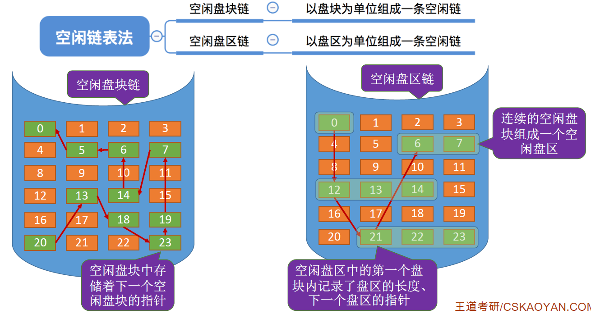

# 操作系统小总结

# 目录

第一章 计算机系统概述

1.1操作系统

第二章 进程管理

2.1进程和线程

2.2调度

2.3互斥同步

2.4死锁

第三章 内存管理

3.1内存管理概念

3.2虚拟内存管理

第四章 文件管理

4.1文件管理

4.2磁盘管理

第五章 输入输出管理(IO)

5.1输入输出管理(IO)

---

## 第一章 概述

操作系统在干嘛，底层思想

## 第二章 进程管理

操作系统的最大作用，核心功能

## 第三章 内存管理

物理地址到逻辑地址的映射，脱离硬件第一步

## 第四章 文件管理

再封装管理各种数据，脱离硬件第二部，到达软件层面

## 第五章 I/O管理

联通硬件和软件，捋一下各种功能

# 第一章 计算机系统概述

目的：为什么要有操作系统，拿来干嘛？管理什么？

思想：有什么底层思想支撑操作系统的开发？

历史：操作系统是怎样一步一步发展起来的？

组成：操作系统运行机制，靠什么实现的？

操作：由底层思想可以延伸出什么基本操作？

状态：操作系统在运行过程中有哪些状态？

结构：操作系统的结构，和位于计算机哪个位置？

---

### 目的：为什么要有操作系统，拿来干嘛？管理什么？

==概念、功能、管理、接口==

### 思想：有什么底层思想支撑操作系统的开发？

==并发、共享、虚拟、异步、封装==

### 历史：操作系统是怎样一步一步发展起来的？

==手工操作阶段、单道批处理、多道批处理、分时操作系统、实时操作系统、分布式、个人==

### 组成：操作系统运行机制，靠什么实现的？

==内核程序、自编程序、原语、时钟管理、中断机制==

### 操作：由底层思想可以延伸出什么基本操作？

==中断、异常、系统调用==

### 状态：操作系统在运行过程中有哪些状态？

==用户态、内核态==

### 结构：操作系统的结构，和位于计算机哪个位置？

==大内核、微内核、用户、应用程序、非内核功能、进程管理、存储管理、设备管理、时钟管理、中断处理、原语、裸机（纯硬件）==

# 第二章 进程管理

## 2.1进程和线程

进程是什么？

进程的功能有哪些特征实现？

进程的状态有哪些，怎么转换？

进程是怎样控制的？

进程由什么组成？

进程间怎么通信？

线程是什么和进程有什么不一样？

线程有哪些，多线程有哪些？

---

### 进程是什么？

==实现操作系统的并发性和共享性==

### 进程的功能有哪些特征实现？

==动态性、并发性、独立性、异步性、结构性==

### 进程的状态有哪些，怎么转换？

==运行态、就绪态、阻塞态、创建态、结束态==

==运行态可以返回就绪态，时间片结束==

### 进程是怎样控制的？

==进程创建（PCB）、进程终止（正常结束、异常结束、外界干预）、进程的阻塞和唤醒（阻塞原语、唤醒原语）、进程切换（内核态下完成）==

### 进程由什么组成，组织方式有哪些？

==进程控制块（进程描述信息、进程控制和管理信息、资源分配清单、处理及相关信息）、程序段（CPU执行程序代码段）、数据段（原始数据、中间数据、最终结果）==

==链接方式（PCB组成的队列）、索引方式（索引表）==

### 进程间怎么通信？

==共享存储、信息传递（原语）、管道通信（半双工）==

### 线程是什么和进程有什么不一样？

==进程是独立调度的基本单位，线程是支援的基本单位==

### 线程有哪些，多线程有哪些？

==用户级线程、内核级线程==

==多对一（效率高、一堵全堵、不能同时运行在处理机）、一对一（开销大）、多对多（提高并发性，又适当降低开销）==

## 2.2调度

调度是什么，有哪些？

调度的使用时机在哪？

调度的方式有哪些？

调度的基本准则是什么？

加入调度后进程的基本状态变为哪七种？

典型调度算法有哪些？

---

### 调度是什么，有哪些？

==合理的分配处理机==

==作业调度（高级调度，一次）、中级调度（内存调度，进出内存）、进程调度（低级调度，选取就绪队列）==

### 调度的使用时机在哪？

==不能切换的情况、可以切换的情况==

### 调度的方式有哪些？

==非剥夺调度方式、剥夺调度方式==

### 调度的基本准则是什么？

==CPU利用率（尽可能忙碌）、系统吞吐量（单位时间内处理的作业数量）、周转时间（作业提交到完成的时间）、等待时间（作业等待处理机的时间）、响应时间（提交到首次响应的时间）==

### 加入调度后进程的基本状态多了什么？

==就绪挂起、阻塞挂起==

### 典型调度算法有哪些？

先来先服务（不利于IO繁忙型业务）

短作业优先算法（平均周转时间最短、饥饿）

优先级调度算法（饥饿）

高响应比算法（响应比 =（等待时间+要求服务时间）/ 要求服务时间 = 1 + 等待时间 / 要求服务时间）

时间片轮转法（分时系统）

多级反馈队列调度法（饥饿）

## 2.3互斥同步

临界资源

同步

互斥

信号量机制

管程

---

### 临界资源

只允许一个进程使用

### 同步

直接制约关系，相互合作

==空闲让进、忙则等待、有限等待、让权等待==

### 互斥

间接制约关系，一个访问临界区另一个不能访问

### 信号量机制

wait：资源-1、signal：资源+1

两个原语

==互斥信号量mutex、进入区P（申请资源）、退出区V（释放资源）==

### 管程

模块化

## 2.4死锁

定义

原因

策略

预防

避免

检测和解除

区别

---

### 定义

资源竞争造成的僵局，没有外力作用无法解除

### 原因和必要条件

==资源竞争、顺序非法==

==互斥条件、不可剥夺条件、请求并保持条件、循环等待条件（你等我我等你）==

### 预防

破坏某一个必要条件

破坏互斥条件（==允许共享使用==）、破坏不可剥夺条件（导致饥饿）、破坏请求并保持条件（==一次申请完==它所需要的全部资源）、破坏循环等待条件（顺序资源分配法）

### 避免

银行家算法（只分配给会进入安全状态的程序）

### 检测和解除

资源分配图，只要能约掉就不存在死锁。矩形表示资源节点，小圆代表资源数量。

资源==剥夺==法、==撤销==进程法、进程==回退==法

## 2.5 信号量机制的各种问题应用

生产者消费者问题

多生产者多消费者问题

吸烟者问题

读者-写者问题

哲学家问题

---

### 生产者消费者问题

==互斥P一定要在同步P之后==

否则会导致：我要放东西通过了，没人占用但满了放不进去，去到消费者，通道被生产者占住了，形成死锁
同步：查看缓存区容量和非空区
互斥：消费者和生产者不能同时使用缓存区

### 多生产者多消费者问题

互斥：前P后V

同步、前驱：前V后P

### 吸烟者问题

供应者到抽烟者一一对应，==多个==信号量

抽烟者抽完只有==一种==返回信号

### 读者-写者问题

写和读，写和写不能同时访问，==但读和读可以同时访问==

+ 读优先：==第一个读者先加两把锁，都关上，再打开互斥锁，让其他读者进行访问==
+ 写优先（相对优先）：==第一个读者先加三把锁，都关上，再打开互斥锁和写优先锁，且先打开写优先锁，使只要读者读完就给写==

### 哲学家问题

SB问题

# 第三章 内存管理

## 3.1 内存管理概念

为什么要有内存管理？

内存管理的功能是什么？

程序是怎么装入和链接的？

动态分区分配

分页

分段

---

### 为什么要有内存管理？

程序执行前需要先放到内存中才能被CPU处理——==缓和CPU与硬盘之间的速度矛盾==

### 内存管理的功能是什么？

==内存空间的分配与回收、地址转换、内存空间的扩充、存储保护==

#### 分配与回收

连续分配管理方式：==单一连续分配==（低地址区，单用户、利用率低）、==固定分区分配==（固定划分相等或不等的区、内部碎片、多道程序、利用率低）、==动态分区分配==（根据大小建立分区、分区外部碎片、紧凑技术）

非连续分配管理方式：==分页、分段==

#### 地址转换

绝对装入（单道程序阶段）：无操作系统

可重定位装入（静态重定位）（早期多道批处理阶段）：一次性全部装入，不能在内存中移动）

动态运行时装入（动态重定位）（==现代操作系统==）：==当程序真正执行时才进行转换==

==地址转换过程：逻辑地址->界地址寄存器->重定位寄存器->物理地址==

#### 内存空间的扩充（覆盖、交换、虚拟）

覆盖技术：将用户空间分为==一个==固定区和==若干==覆盖区，活跃部分放在==固定区==，即将访问的段放在==覆盖区==。

交换技术：把磁盘空间分为==文件区==和==对换区==两部分，将处于等待状态的程序从内存中转移到辅存，==暂时换出==外存。

覆盖与交换区别：覆盖是在==同一个程序==或进程中的；交换是在==不同进程（或作业）==之间的

#### 内存保护

CPU中设置上、下限寄存器，==判断是否越界==

重定位寄存器（基址寄存器）和界地址寄存器（限长寄存器）：重定位寄存器中包含最小物理地址值，界地址寄存器包含==逻辑地址的最大值==

### 程序是怎么装入和链接的？

步骤：编译（形成若干目标模块）、链接（目标模块与库函数链接）、装入（内存执行）

链接：静态链接（完整可执行）、装入时动态链接（边装入变链接）、运行时动态链接（需要时才链接）

装入：绝对装入（实际内存地址）、可重定位装入（相对地址）、动态运行时装入（需要时才地址转换）

### 动态分区分配

==首次适应算法==（不排序第一个）、==最佳适应算法==（容量递增顺序排列第一个、最多的外部碎片）、==最坏适应算法==（容量递减第一个、减少小碎片、不利于大工程）、==邻近适应算法==（上次结束位置查找，概率相同，所以容易把高地址大分区用完）

### 分页

第一步：分好块，在第几块第几个（页号P和页内偏移量W）

第二部：去问一下我的新家在哪，获得新家块（去==页表寄存器==看页表起始地址和判断，查==页表==找到内存块号）

第三步：新家号，在加上偏移量，就算出物理地址（内存块号加页内偏移W得到物理地址）

添加==块表==，直接省略第二步，因为如果有，直接就能查到内存块号

两级列表解决页表必须连续存储的问题

### 分段

页是信息的==物理单位==，完全是==系统行为==，对用户是==不可见的==。分页的用户进程地址空间是==一维==的，程序员只需给出一个记忆符即可表示一个==地址==。

段是信息的==逻辑单位==，分段对用户是==可见的==，用户编程时需要显式地给出==段名==。分段的用户进程地址空间是==二维==的，程序员在标识一个地址时，既要给出==段名==，也要给出==段内地址==。

## 3.2 虚拟内存管理

虚拟内存管理与传统存储管理的不同在哪？

什么是局部性原理？

虚拟内存是怎样实现的？

有哪些页面置换法？

有哪些页面分配策略？

抖动

工作集

---

### 虚拟内存管理与传统存储管理的不同在哪？

传统：作业必须一次性==全部装入==内存后，才能开始运行，作业装入内存后，==一直驻留在内存中==，任何部分不会被换出。

虚拟：基于局部性原理，程序的一部分装入内存，一部分留在外存，==需要的时候将外存内容调入内存==，就好像产生了一个巨大的内存空间

==多次性（一次作业多次调入）、对换性（换进换出）、虚拟性（大于实际内存）==

### 什么是局部性原理？

#### 时间局部性

一条指令执行后，不就之后指令可能被再次执行，数据被访问后，不久后数据可能再次被访问

原因：程序中存在着大量的==循环操作==

时间局部性通过将==最近使用的指令==和数据存储在==高速缓冲存储器中==

#### 空间局部性

一旦程序访问了某个存储单元，不久之后附近的存储单元也将被访问

原因：指令通常是==顺序存放==，顺序执行的，数据一般也是以向量、数组、表等形式簇聚存储的

空间局部性使用较大的==高速缓存==，将预取机制继承到高速缓存控制逻辑中实现

### 虚拟内存是怎样实现的？

请求==分页==存储管理、请求==分段==存储管理、==请求段页式==存储管理

一定容量的内存和外存、页表机制（或者段表机制）、中断机制、地址变换机制

### 有哪些页面置换法？

最佳置换算法（OPT）：选择永不使用或者==最长时间内==不再访问的页面进行淘汰，但是现实中是无法预知的

先进先出页面置换算法（FIFO ）：优先淘汰==最早进入==的页面，与进程的实际运行规律不匹配

最近最久未使用（LRU ）置换算法：选择==最近最长时间==没有被访问的页面进行淘汰，每个页面设置一个访问字段，用来标识上次被访问到现在经历的时间

时钟（CLOCK）置换算法：当某页==被访问时，其访问位置为1==。当需要淘汰一个页面时，只需检查页的访问位。==如果是0，就选择该页换出==；==如果是1，则将它置为0==，暂不换出，继续检查下一个页面，若第一轮扫 描中所有页面都是1，则将这些页面的访问位依次置为0后，再进行第二轮扫描（第二轮扫描中一定会 有访问位为0的页面，因此简单的CLOCK 算法选择一个淘汰页面==最多会经过两轮扫描==）

改进型CLOCK算法：使用位（访问位）的基础上增加==修改位==

### 有哪些页面分配策略？

固定分配局部置换

可变分配全局置换

可变分配局部置换

### 抖动

==刚换出的页面又要换入内存==

### 工作集

某段时间内，==进程要访问的页面集合==。

# 第四章 文件管理

## 4.1 文件管理

文件相关概念

文件逻辑结构

目录结构

文件共享

文件保护

文件系统的实现

---

### 文件相关概念

数据项、记录、文件

名称、标识符、类型、位置、大小、保护、时间

创建文件、写、读、文件重定位（文件寻址）、删除文件、截断文件

### 文件逻辑结构

无结构文件：流式文件，==字符流==组成

有结构文件（记录式文件）：顺序文件（效率高、增删改查难）、索引文件（定长、变长）、索引顺序文件（分组）、直接文件或散列文件（函数转换决定地址）

### 目录结构

单级目录（不能重名）、两级目录结构（不能分类）、多级目录结构（树形）、无环图目录结构（同一节点有向边，共享）

### 文件共享

基于索引节点的共享方式（==硬==链接）：直接指针指向文件，只要还有一个指针，文件（索引节点）就==不能删除==
利用符合链实现文件共享（==软==链接）：保存共享文件的路径（==快捷方式==），根据路径寻找文件。

### 文件保护

口令保护：用户请求访问时需要提供相应的口令，直接存储在系统内部==不安全==

加密保护：用户访问需要秘钥==解密==，加密和解密需要==花费一定时间==

访问控制：==规定每个用户名及其所允许的访问类型==

## 4.2 文件系统的实现

### 文件层结构

用户调用接口：文件系统==为用户提供==与文件及目录有关的==调用==

文件目录系统：==管理文件目录==，管理活跃文件目录表，管理读写状态信息表，管理用户进程的打开文件表，管理与组织存储设备上的文件目录结构，调用下一级存取控制模块。

存取控制验证：实现==文件保护==，将用户的访问请求与FCB中指示的访问控制权限进行比较，以确认访问的合法性

逻辑文件系统管理文件信息缓冲区：逻辑文件系统与文件信息缓冲区的主要功能是，根据文件的逻辑结构将用户要读写的逻辑记录转换成文件==逻辑结构内的相应块号==

物理文件系统:把逻辑记录所在的相对块号转换成实际的==物理地址==

辅助分配模块：管理辅存空间，负责==分配==辅存空闲空间和==回收==辅存空间

设备管理程序模块：==分配设备==，分配设备读写用缓冲区，磁盘调度，启动设备，处理设备中断，释放设备读写缓冲区，==释放设备==

### 目录实现

线性表、哈希表

### 文件分配方式

连续分配：每个文件在磁盘上占有一组==连续的块==，磁盘地址定义了磁盘上的一个线性排序。访存1次

链接分配：磁盘块分布在磁盘的任何地方，除最后一个盘块，其他盘块都有指向==下一个盘块的指针==

索引分配：索引分配解决了链接分配不能直接访问的问题，支持==随机访问==

### 文件存储空间管理

文件存储设备管理的实质是对空闲块的组织和管理，包括空闲块的组织、分配与回收等问题

#### 空闲表法

属于连续分配方式，系统为空闲区建立一张空闲盘块表，每个空闲区第一个盘块号，该区的空闲盘块数等信息。

#### 空闲链表法

将所有的空闲盘区拉成一条空闲链，根据构成链所有的基本元素不同，可以把链表分成两种形式

空闲盘块链：将磁盘上所有空闲空间以盘块为单位拉成一条链

空闲盘区链：将磁盘上所有空闲盘区拉成一条链

#### 位示图法

采用二进制的一位来表示一个盘块的使用情况，磁盘上所有的盘块都有一个二进制位与之对应

#### 成组链接法

UNIX使用，结合了空闲表和空闲链表法克服了表太大的缺点

把顺序的n个空闲扇区地址保存在第一个空闲扇区内，其后一个空闲扇区内则保存另一顺序空闲扇区的地址

## 4.3 磁盘管理

### 磁盘结构

磁盘、磁道（同心圆）、扇区（数据量相同）、盘面、柱面

磁头是否可移动

固定头磁盘∶磁头相对于盘片的径向方向固定

活动头磁盘：每个磁道一个磁头，磁头可以移动

盘片是否可更换

固定盘磁盘∶磁头臂可以来回伸缩定位磁道，磁盘永久固定在磁盘驱动器内

可换盘磁盘∶可以移动和替换

### 磁盘调度算法

#### 读写时间组成

==寻找时间（寻道时间）TS==：在读/写数据前，将磁头移动到指定磁道所花的时间。

①启动磁头臂是需要时间的。假设耗时为s；

②移动磁头也是需要时间的。假设磁头匀速移动，每跨越一个磁道耗时为m，总共需要跨越n条磁道。则：寻道时间TS = s + m*n

==延迟时间TR==：通过旋转磁盘，使磁头定位到目标扇区所需要的时间。

设磁盘转速为r（单位：转/秒，或转/分），则平均所需的延迟时间TR = （1/2）*（1/r） = 1/2r

==传输时间Tt==：从磁盘读出或向磁盘写入数据所经历的时间，假设磁盘转速为r，此次读/写的字节数为b，每个磁道上的字节数为N。则：传输时间Tt = （1/r） * （b/N） = b/（rN）

#### 先来先服务（FCFS）

按照进程请求访问磁盘的先后顺序进行调度

优点：公平实现简单

缺点：适用于少量进程访问，如果进程过多算法更倾向于==随机调度==

#### 最短寻找时间优先（SSTF）

选择调度处理的磁道是与当前磁头所在磁道距离最近的磁道

优点：性能强于先来先服务算法

缺点：容易产生==饥饿==现象

#### 扫描算法（SCAN）

在磁头当前==移动方向上==选择与当前磁头所在的磁道距离最近的请求作为下一次服务对象，只有磁头移动到==最外侧磁道的时候才能往内移动==，移动到最内侧磁道的时候才能往外移动，因此也叫电梯算法。

优点：寻道性能好，可以==避免饥饿==现象

缺点：对最近扫描过的区域不公平，访问局部性方面不如FCFS和SSTF好

#### 循环扫描算法（c-SCAN）

磁头单向移动，回返时直接回到起始端，而不服务任何请求

#### LOOK与C-LOOK

在SCAN与C-SCAN算法的基础上规定了查看移动方向上是否有请求，如果没有就不会继续向前移动，而是直接改变方向（LOOK）或者直接回到第一个请求处（ C-LOOK）

### 磁盘管理

#### 磁盘初始化

低级格式化：磁盘分扇区，为每个扇区采用特别的数据结构（头、数据区域、尾部组成），头部含有一些磁盘控制器所使用的信息

进一步格式化处理∶磁盘分区，对物理分区进行==逻辑格式化==（创建文件管理系统），包括空闲和已分配的空间及一个初始为==空的目录==

#### 引导块

计算机启动时运行==自举程序==，初始化CPU寄存器、设备控制器和内存等，然后启动操作系统

组局程序通常保存在ROM中，在ROM中保留很小的自举块，完整的自举程序保存在启动块上拥有启动分区的磁盘称为启动==磁盘或系统磁盘==

#### 坏块

无法使用的扇区

对于简单的磁盘，可以在逻辑格式化时（建立文件系统时）对整个磁盘进行坏块检查，==标明哪些扇区是坏扇区==，比如：在FAT表上标明

处理方式

简单磁盘：==手动处理==，对坏块进行标记，程序不会使用

复杂磁盘：控制器维护一个==磁盘坏块链表==，同时将一些块作为==备用==，用于替代坏块（扇区备用）

# 第五章 输入输出管理(IO)

I/O控制器的主要功能是什么？

I/O有哪些控制方式？

I/O有哪些层次结构？

核心子系统包含哪些？

假脱机

设备的分配与回收

缓冲区管理

---

## I/O控制器的主要功能是什么？

接收和识别CPU发出的命令（要有控制寄存器）、向CPU报告设备的状态（状态寄存器）、数据交换（数据寄存器）、地址识别（由I/O逻辑实现）

## I/O有哪些控制方式？

### 程序直接控制方式

计算机从外部设备读取数据到存储器，每次读一个字的数据，对读入的每个字，CPU都要对外没状态进行==循环检查==，知道确定该字已经在I设备控制器的数据寄存器中。

读写单位：==字==

优点：容易实现，操作简单

缺陷∶CPU高速性和IO设备的低速性的矛盾（降低了CPU的利用率），CPU和IO设备只能串行工作

### 中断驱动方式

允许IO设备主动打断CPU的运行并请求服务，进而==解放CPU==，使其向IO控制器发送读命令后可以继续做其他有用的工作

读写单位∶==字==

优点∶比程序直接控制方式有效

缺点：数据的传输必须要经过CPU，仍然后消耗CPU的时间

### DMA方式

在IO设备和内存之间开辟直接的数据交换通路，==彻底解放CPU==

读写单位：==数据块==

设备==直接送入内存==

只有当一个或多个数据块开始和结束的时候，CPU才会进行干预

命令/状态寄存器（CR）：用于接收CPU发送的IO命令和有关控制信息或者设备状态

内存地址寄存器（MAR）：数据直接在设备与内存之间交互

数据寄存器（DR）：用于暂存从设备到内存或者从内存到设备的数据

数据计数器（DC） ：存放本次要传送的字（节）数

### 通道控制方式

设置一个专门负责输入/输出的处理机（DMA方式的发展），实现对一组数块的读写以及相关控制和管理为单位干预

读写单位：==一组块==

优点：有效的提高了系统资源利用率

缺点：实现较为复杂

### DMA与通道的区别

DMA需要==CPU来控制==传输的数据块大小、传输的内存位置、而通道方式中这些信息是由==通道控制==的

DMA控制器对应一台设备与内存传递数据，通道可以控制多态设备与内存的数据交换

## I/O有哪些层次结构？

### 用户层IO软件

==实现与用户交互的接口==，用户可以直接调用在用户层提供的，与IO操作有关的==库函数==，对设备进行操作

### 设备独立性软件

用于实现用户程序与设备驱动器的==统一接口、设备命令、设备保护、差错控制及设备分配与释放==，同时为设备管理与数据传送提供必要的存储空间

设备独立性也称为设备==无关性==，使得应用程序独立于具体使用的物理设备（使用逻辑设备名）

使用逻辑设备名的好处：增加设备分配的灵活性；易于实现IO重定向

主要功能

执行所有设备的公有操作（设备的分配与回收，==逻辑设备名映射为物理设备名==，对设备进行保护，进制用户直接访问设备），屏蔽设备之间数据交换的速度差异等

向用户层（文件层）提供统一接口∶无论哪种设备，他们向用户提供的==接口都是相同的==

### 设备驱动程序

与硬件直接相关，负责实现系统==对设备发出的操作命令==，驱动IO设备工作的驱动程序

### 中断处理程序

用于保存被中断进程的CPU环境，转入相应的中断处理程序进行处理，处理完并恢复被中断进程的现场后，返回被中断进程

### 硬件设备

IO设备通常包括一个机械部件和一个电子部件

## 核心子系统包含哪些？

设备独立性软件、设备驱动程序、中断处理程序

主要提供==IO调度==，缓冲与高速缓存，设备分配与回收，假脱机，设备保护和差错处理

## 假脱机

输入进程∶模拟脱机输入时的外围控制机，将用户要求的数据从输入机==通过输入缓冲区送到输入并中==，当CPU需要数据，直接将==输出井中的数据送入内存==

输出进程：模拟脱机输出时的外围控制机，把用户要求输出的数据先从内存送到输出井中，待输出设备空闲时，再将输出井中的数据经过输出缓冲区送到输出设备

通俗一点就是，如果设备被占用，我们就先把数据暂存一下，等到设备空闲了就把这些数据输送到设备中

## 设备的分配与回收

―根据用户IO请求分配设备，原则：充分发挥设备的使用效率，避免进程死锁

## 缓冲区管理

缓和CPU与IO之间的速度差异矛盾

单缓冲、双缓冲、循环缓冲、缓冲池

### 高速缓存与缓冲区对比

#### 相同点

都介于高速设备和低速设备之间

#### 不同

+ 存放数据

  高速缓存：存放的是低速设备上的某些数据的==复制数据==

  缓冲区：存放的是低速设备==传递==给高速设备的数据，这些数据在低速设备上==不一定有备份==，这些数据再从缓冲区传送到高速设备

+ 目的

  高速缓存∶高速缓存存放的是高速设备==经常要访问==的数据，如高速缓存中数据不在，高速设备就要访问低速设备

  高速设备和低速设备的通信都要经过==缓冲区==，==高速设备永远不会去直接访问低速设备==

